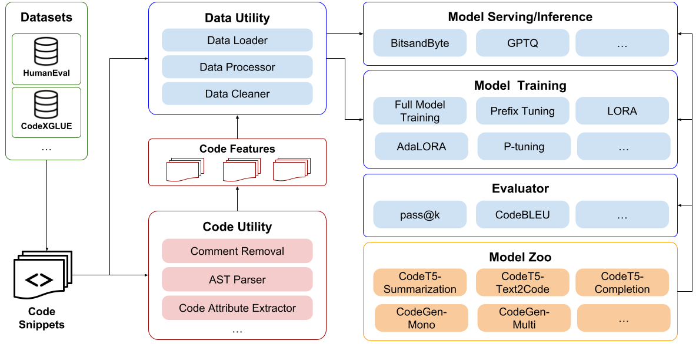

# NaturalCC Code Agent · 中文教程

`code_agent` 是一个**本地运行的上下文感知编码 Agent**：它把 NaturalCC 的静态项目解析能力与 Aider 的代码修改能力组合在一起，通过 **Web UI、终端 CLI 和 VS Code 插件**三种方式使用。

它不是通用聊天机器人——它会读你的项目、理解符号与依赖、修改文件、跑测试验证，并在每一步都受到**审批流、预算和白名单**的约束。



---

## 目录

1. [核心特性](#1-核心特性)
2. [环境要求](#2-环境要求)
3. [安装](#3-安装)
4. [快速开始](#4-快速开始)
5. [Web UI 使用教程](#5-web-ui-使用教程)
   - [5.1 界面总览](#51-界面总览)
   - [5.2 Agent 模式：完整操作流程](#52-agent-模式完整操作流程)
   - [5.3 记忆系统操作](#53-记忆系统操作)
   - [5.4 CodeGraph 知识图谱](#54-codegraph-知识图谱)
   - [5.5 Pipeline 模式：代码补全 / 修复 / 漏洞检测](#55-pipeline-模式代码补全--修复--漏洞检测)
   - [5.6 上下文引用与快捷键](#56-上下文引用与快捷键)
6. [CLI 使用教程](#6-cli-使用教程)
7. [VS Code 插件](#7-vs-code-插件)
8. [配置参考](#8-配置参考)
9. [内置工具清单](#9-内置工具清单)
10. [安全模型](#10-安全模型)
11. [工作原理简述](#11-工作原理简述)
12. [API 概览](#12-api-概览)
13. [运行测试](#13-运行测试)
14. [常见问题](#14-常见问题)
15. [项目结构](#15-项目结构)
16. [更多文档](#16-更多文档)
17. [License](#17-license)

---

## 1. 核心特性

**🧠 持久化 Agent 模式（Durable Agent）**
- 多轮会话（Thread）与独立任务（Run），全部事件**追加式落盘 SQLite**，可审计、可恢复；
- 上下文超限时**自动压缩**为结构化 checkpoint（触发阈值约 47k tokens，默认 65k 窗口）；
- **长期记忆**：候选 → 人工审查 → 激活 → FTS5 关键词检索，记忆不会未经确认自动生效；
- **Token 精确预算**：LLM 调用数 / 工具调用数 / 输入 Token / 时长 / 成本，超限自动停止。

**🛡️ 安全可控**
- 所有写文件、执行命令、网络操作默认**需要人工审批**（可按风险等级一键批准）；
- 命令白名单 + Git 危险子命令黑名单（`push`/`commit`/`reset` 等一律禁止）；
- 敏感路径禁读（`.ssh`/`.aws`/`.env`/证书文件等），工具结果自动脱敏密钥。

**🧰 21 个内置工具**
文件读写、精确补丁、Aider 委托编辑、命令执行、测试发现与运行、Git 状态与差异、CodeGraph 知识图谱检索、NaturalCC 符号解析。

**🗺️ 三种入口**
- React Web UI（FastAPI 后端）；
- Bun + Ink 终端 CLI（REPL 交互模式）；
- VS Code 插件（编辑器内直接打开 Agent 面板）。

**🧩 传统 Pipeline 模式**
代码补全、代码修复、漏洞检测（含自动修复）、代码总结、设计稿转代码、知识图谱可视化等热插拔 Feature 插件。

---

## 2. 环境要求

| 依赖 | 版本 | 用途 | 必需？ |
|---|---|---|---|
| Python | **3.12**（`>=3.12,<3.13`） | 后端与 Agent 核心 | ✅ |
| [uv](https://docs.astral.sh/uv/) | 最新 | Python 依赖管理（不支持 pip 安装） | ✅ |
| Node.js + npm | 18+ | Web 前端构建 | ✅（仅 Web UI / 插件） |
| [bun](https://bun.sh/) | 最新 | CLI 入口 | 仅 CLI |
| aider | — | `aider.edit` 工具与 Pipeline 编辑 | `uv sync` 自动安装 |
| [CodeGraph](https://github.com/colbymchenry/codegraph) CLI | 最新 | 知识图谱索引、符号检索、调用路径分析 | 知识图谱能力必需 |
| libclang-18 | 系统级 | NaturalCC 解析 C/C++ | 仅 C/C++ 解析 |

系统依赖（C/C++ 解析时）：

```bash
# Ubuntu / Debian
sudo apt install libclang1-18
# macOS
brew install llvm@18
```

---

## 3. 安装

```bash
cd code_agent

# 1. 创建虚拟环境并安装全部依赖（含 dev 组，uv 自动读取 uv.lock）
uv sync

# 2. 下载 DeepSeek V3 分词器（Agent 模式的 token 精确计数必需）
uv run python scripts/install_deepseek_tokenizer.py

# 3. 安装前端依赖
cd webui
npm install
cd ..
```

> 💡 `uv sync` 会同时安装 `aider-chat`、`clang==18.1.8`、`torch`、`transformers` 等依赖，体积较大，请耐心等待。

### 3.1 安装 CodeGraph CLI

CodeGraph 不随 `uv sync` 自动安装。需要先安装上游 CLI，并确保新的终端里能直接运行 `codegraph`：

```bash
# macOS / Linux / WSL
curl -fsSL https://raw.githubusercontent.com/colbymchenry/codegraph/main/install.sh | sh
```

```powershell
# Windows PowerShell
irm https://raw.githubusercontent.com/colbymchenry/codegraph/main/install.ps1 | iex
```

如果已经有 Node.js，也可以用 npm 全局安装：

```bash
npm i -g @colbymchenry/codegraph
```

安装后重新打开一个终端并检查：

```bash
codegraph --version
```

上游 README 里的 `codegraph install` 用于把 CodeGraph MCP 自动接入 Claude Code、Codex CLI、Cursor 等通用 Agent。本项目的 Web UI 不依赖这一步：NaturalCC 后端会通过 `CODE_AGENT_CODEGRAPH_BIN` 直接调用 `codegraph` CLI。只有你还想让其他 Agent 也使用 CodeGraph，才需要额外执行 `codegraph install`。

---

## 4. 快速开始

### 4.1 API Key 使用方式

不要把真实 API Key 写进代码、README、截图或 Git 历史。

- **Web UI 的 Agent / Pipeline 模式**：推荐在右侧 Settings 的 **API key** 输入框中填写，只随本次本地请求发送，不写入会话、Run 快照或 SQLite；
- **Agent 兜底路径**：如果页面没有填写 key，后端网关仍支持从启动后端的终端环境读取 `DEEPSEEK_API_KEY` / `OPENAI_API_KEY`；
- **CLI / 脚本**：可用 `-key` / `--api-key` 显式传入，或在终端环境里设置 `DEEPSEEK_API_KEY`、`OPENROUTER_API_KEY`、`OPENAI_API_KEY`。

PowerShell 当前窗口临时设置示例：

```powershell
$env:DEEPSEEK_API_KEY = "你的新 key"
```

Linux / macOS / WSL 当前 shell 临时设置示例：

```bash
export DEEPSEEK_API_KEY="你的新 key"
```

其他配置都有合理默认值，详见 [配置参考](#8-配置参考)。项目内提供了 `.env.example` 模板：

```bash
cp .env.example .env      # 如需环境变量兜底，可填好后加载：
set -a; source .env; set +a
```

> 程序**不会自动读取 `.env` 文件**；只有你手动 `source` 后，里面的变量才会进入当前终端环境。`.env` 已被 `.gitignore` 忽略，不能提交真实密钥。

### 4.2 启动

**推荐方式：单服务器启动**

```powershell
# 1. 构建前端页面
cd code_agent\webui
npm install
npm run build

# 2. 启动后端，同时托管网页
cd ..
uv run python agent_web_api.py --host 127.0.0.1 --port 7860
```

浏览器直接打开 **http://127.0.0.1:7860/** 即可。这个端口同时提供网页界面和后端 API。

Linux / macOS / WSL 命令等价写法：

```bash
cd webui && npm run build && cd ..
uv run python agent_web_api.py --host 127.0.0.1 --port 7860
```

### 4.3 验证

```bash
# 后端健康检查
curl http://127.0.0.1:7860/api/health
# → {"status":"ok",...}

# 冒烟测试（无需 API Key）
python smoke_test.py
```

---

## 5. Web UI 使用教程

### 5.1 界面总览

启动服务后，打开 **http://127.0.0.1:7860/**，界面分为四块：

| 区域 | 内容 |
|---|---|
| **左侧边栏** | `New conversation` 新建会话按钮、`Search conversations` 搜索框、按 `Today / Previous 7 days / Earlier` 分组的会话历史（每个会话显示状态标签和运行次数，右侧 🗑 删除）、底部主题切换（`Light theme` / `Dark theme`）与 `Settings` 按钮 |
| **顶部状态栏** | 状态点 + 状态文字（`Ready / Running / Complete / Needs attention`）、会话标题、**Workspace path** 输入框、模型下拉框、**Runtime mode** 下拉框（`Agent` / `Pipeline`，默认 `Agent`）、Settings 图标 |
| **主对话区** | 消息流 + 底部输入框（placeholder：`Describe what you want to do...`），输入框下方有 `Add context`、`Budget`、`Send` 按钮 |
| **右侧 Settings 抽屉** | `Workspace`（项目根目录）、`Knowledge graph`（知识图谱）、`Model`（模型与 API key）、`Feature`（Pipeline 插件表单）、`Status`（状态指标）、`Equivalent CLI`（等效命令行） |

**Agent 模式**下主界面还会多一条 **Budget 工具栏**：三个进度条实时显示 `LLM calls`、`Tool calls`、`Input tokens` 的消耗，以及一个 **`Run details`** 按钮（打开当前 Run 的详情抽屉）。

### 5.2 Agent 模式：完整操作流程

Agent 模式（Runtime mode 选 `Agent`）是默认模式，对应后端 `/api/agent/*` 接口。一次典型的完整操作：

**① 新建会话（Thread）**

1. 先在顶部填好 **Workspace path**（你要 Agent 操作的项目绝对路径，例如 `D:\my-project`）；
2. 点击左侧边栏 **`New conversation`**；
3. 会话创建后自动载入，标题默认 "New task"，后续可改。

**② 发送第一条指令**

- 在底部输入框用自然语言描述任务，例如：*「给 StudentManager.java 的 addStudent 方法补上参数校验，并写一个单元测试」*；
- 按 `Enter` 或点击 **`Send`**；
- 界面出现 `Creating durable Agent run...`，进入 `Running...` 状态，事件日志实时滚动显示。

**③ 观察运行过程**

- 消息气泡里显示事件流（模型调用、工具执行、结果）；
- 顶部 Budget 工具栏实时更新三类消耗；
- 点击 **`Run details`** 打开详情抽屉，可以查看：审批按钮、`Resume` / `Pause` / `Cancel` 控制、Usage（Tokens / Cost / Prompt cache hit）、**Changed files & verification**（改过哪些文件、验证状态）、**Event timeline**（最近 30 个事件的顺序与摘要）。

**④ 审批高风险操作（关键！）**

审批返回 404 表示当前服务的数据库中不存在该 Run。页面会清除失效的审批按钮；请连接原来的服务与数据库后重新加载会话，若任务已删除则重新提交指令。每份项目默认使用自己的 `code_agent/outputs/agent_runtime.db`，也可通过 `CODE_AGENT_DB` 指定数据库。任务快照缺失或待审批操作已变化时返回 409。审批前会核对当前待执行操作，失效任务不会被自动重建或执行。

Agent 要**写文件、执行命令**时（这些工具风险等级非只读），Run 会进入 `WAITING_APPROVAL` 状态，消息气泡底部出现按钮：

- **`Approve write` / `Approve execute`**：按**风险等级**批准——批准一次后，本次 Run 中该等级的所有后续操作都放行；
- **`Reject`**：拒绝本次操作，工具返回 `UserRejected`，Agent 会绕开继续。

> 审批粒度是「风险等级 × Run」：`write`、`execute`、`network`、`git_write` 各批各的。想更细粒度控制可以用 API 单步执行（见 [API 概览](#12-api-概览)）。

**⑤ 暂停 / 恢复 / 取消**

在 `Run details` 抽屉中：

- `running` 时显示 **`Pause`**，暂停后显示 **`Resume`**；
- 任意非终态都可 **`Cancel`**；
- 对应 API：`/api/agent/runs/{runId}/pause`、`/resume`、`/cancel`。

**⑥ 预算管理**

- 点击输入框下方的 **`Budget`** 按钮弹出设置面板，可修改 `LLM calls`、`Tool calls`、`Input token limit` 三项，点 **`Save budget`** 保存；
- 超限时 Run 进入 `budget_exhausted` 终态，消息显示 `Budget exhausted: {reason}`；之后可调大预算再继续会话。

**⑦ 任务完成**

- 模型给出最终回复后 Run 进入 `Complete`，顶部状态点变绿；
- 之后在同一会话里继续发消息，会开启**新的 Run**，但共享会话上下文与长期记忆。

### 5.3 记忆系统操作

Agent 可以从对话中提炼**长期记忆**（你的偏好、项目约束、架构决策等），且**必须由你人工确认才会生效**。全部操作在 `Run details` 抽屉的 **Memory review** 区段完成：

1. **选证据**：把鼠标移到某条消息上，右下角出现书签图标按钮（`Use as memory evidence`），点击选中（变为 `Selected as memory evidence`），可以多选；
2. **生成提案**：输入框上方出现 `{N} messages selected as evidence` 提示条，点击 **`Create memory suggestions`**（或先 `Clear` 清空）；
3. **审查提案**：模型经过「分析 → 撰写」两阶段，把选中的证据变成提案卡片，出现在 Memory review 面板。卡片上显示：
   - 操作类型（`Create` / `Update` / `Supersede`）、标题、状态标签；
   - Badge：Kind（偏好/项目约束/架构决策/…）、Scope（user / project / thread）、Confidence（置信度）、Verification（验证等级）；
   - 内容摘要、警告与冲突提示；
   - 折叠面板 **Why this was proposed**（证据列表）；
4. **决策**：每张卡片四个按钮——
   - **`Accept and remember`**：批准，记忆激活并写入检索索引；
   - **`Edit`**：先改内容再接受；
   - **`Later`**：延后处理；
   - **`Reject`**：拒绝。

已激活的记忆显示在抽屉底部的 **Active memories** 区段，每条可单独 `Delete`。

> 记忆的验证等级从低到高：`legacy_unverified < model_inferred < user_asserted / tool_observed < test_verified / diff_verified`。由测试验证过的记忆置信度最高。

### 5.4 CodeGraph 知识图谱

在右侧 Settings 抽屉的 **Knowledge graph** 区段（需要本机安装 `codegraph` 可执行文件）：

1. 打开 **`Use knowledge graph`** 开关，状态标签会显示 `Checking / Not installed / Unavailable / Not initialized / Needs sync / Ready`；
2. 状态为未初始化时点 **`Initialize`**（等价于在当前 workspace 执行 `codegraph init .`，会本地生成 `.codegraph/` 索引目录，需要审批）；
3. 代码变动后点 **`Sync`** 增量同步（等价于 `codegraph sync .`）；Agent 自己通过工具修改文件后，也会在下次图检索前尝试自动同步；
4. 状态 `Ready` 后点 **`Open graph`**，在**新窗口**打开交互式 HTML 可视化（对应 `codegraph.visualize` 工具生成的图）。

Agent 对话期间也可以直接让模型调用 `codegraph.explore` 检索符号、调用路径和影响面——检索结果会作为上下文注入模型。

本项目默认设置 `CODE_AGENT_CODEGRAPH_NO_DOWNLOAD=true` 和 `CODE_AGENT_CODEGRAPH_NO_DAEMON=true`：运行时不会让 CodeGraph 静默下载依赖或启动常驻守护进程。这样更适合课堂演示和可控环境；代价是首次安装必须由用户显式完成，索引状态也会在 UI 中可见。`.codegraph/` 是本地派生产物，通常不要提交到 Git。

### 5.5 Pipeline 模式：代码补全 / 修复 / 漏洞检测

Pipeline 模式是早期的一条独立路径：选插件 → 填参数 → 选文件 → 预览 Prompt → 交给 Aider 执行。

1. 顶部 **Runtime mode** 切到 `Pipeline`；
2. 右侧 Settings 抽屉 **Feature** 区段的 `Mode` 下拉选择插件：
   - `code_completion` —— 函数体 / 签名 / 变量 / 类型补全；
   - `code_repair` —— bug / 编译错误 / 测试失败修复，或安全重构；
   - `vulnerability_detection` —— 漏洞检测 + 可选自动修复（hybrid 模式：先 API 分析，再生成修复 Prompt 交 Aider）；
   - `code_summary` —— 代码总结（dry-run，不修改文件）；
   - `design_to_code` / `knowledge_graph` 等；
3. 根据插件显示**动态表单**（如 symbol、completion_type、prefix 等字段）；
4. 在 Settings 的 **Workspace** 区段勾选目标文件（`Add to targets` 可添加自定义路径）；
5. 点 **`Preview`** 预览最终 Prompt（`Status` 区段还能看到等效 CLI 命令），确认后点 **`Send`** 执行，流式返回执行日志。

### 5.6 上下文引用与快捷键

- **@ 引用文件**：在输入框键入 `@` 触发文件模糊匹配（140ms 防抖），或直接粘贴绝对路径后点 **`Add context`** 按钮解析；添加成功显示为 `@filename` 标签，点 ✕ 移除；
- **Enter**：发送消息；**Shift + Enter**：换行；
- 三个面板（侧边栏、Settings 抽屉、Run details）支持拖拽调整宽度/高度；
- 删除会话会弹确认框 `Delete conversation?`；若会话正在运行，需先 `Cancel task first`。

---

## 6. CLI 使用教程

CLI 是 Bun + Ink（React TUI）实现的终端交互式 REPL。

```bash
cd code_agent/cli
bun install                    # 安装 CLI 依赖
cd ..
bun run naturalcc              # 无参数 → 进入 REPL 交互模式
```

**一次性命令模式**

```bash
bun run naturalcc \
  -d /path/to/project \
  -f src/foo.c include/foo.h \
  -i "补全 foo 函数实现" \
  -m deepseek/deepseek-chat \
  --feature code_completion
```

| 参数 | 说明 | 默认 |
|---|---|---|
| `-f, --file [files...]` | 目标文件列表 | `[]` |
| `-i, --instruction` | 修改 / 补全需求 | — |
| `-m, --model` | 模型名（`deepseek/`、`openrouter/`、`openai/` 前缀识别厂商） | `deepseek/deepseek-chat` |
| `-k, --apiKey` | API Key | 读环境变量 |
| `-d, --projectDir` | 项目根目录 | 当前目录 |
| `-s, --symbol` | 目标符号 | — |
| `-t, --completionType` | 补全类型 | — |
| `--feature` | 功能插件 | `code_completion` |
| `--feature-config` | 插件配置 JSON | — |
| `--preview` | 仅预览 Prompt 不执行 | `false` |

**REPL 模式**：输入 `- 开头` 的命令改设置（`-f` / `-m` / `-k` / `-d` / `--run` 等，与上表对应），`/ 开头` 的命令控制 REPL：

| 命令 | 说明 |
|---|---|
| `/help` | 帮助 |
| `/features` | 列出可用插件 |
| `/feature-schema <feature>` | 查看插件配置字段 |
| `/settings` | 显示 / 隐藏设置面板 |
| `/reset` | 重置设置 |
| `/clear` | 清空对话历史 |
| `/exit` | 退出 |

快捷键：`Esc` 中断当前任务，连按两次 `Ctrl+C` 退出。

---

## 7. VS Code 插件

插件在编辑器内自动启动本地 Agent 服务（动态端口 + WebView 面板）。

```bash
cd code_agent
cd webui && npm run build && cd ..   # 先构建前端
npm run package                      # 生成 naturalcc-code-agent-0.1.2.vsix
```

VS Code 中 `Extensions: Install from VSIX...` 安装后，命令面板可用：

- **`NaturalCC: Open Code Agent`** —— 打开 Agent 面板；
- **`NaturalCC: Restart Code Agent Service`** / **`NaturalCC: Stop Code Agent Service`**。

配置项（`settings.json`）：

```json
"naturalccCodeAgent.pythonPath": "/path/to/code_agent/.venv/bin/python",
"naturalccCodeAgent.startupTimeoutMs": 30000
```

插件会自动从环境继承 API Key；也可在面板打开后的 Settings 区手动填写。

---

## 8. 配置参考

全部通过环境变量配置，默认值已适用于 DeepSeek 官方 API。完整模板见 [`.env.example`](.env.example)。

**API 凭据**

| 变量 | 说明 |
|---|---|
| `DEEPSEEK_API_KEY` | DeepSeek API Key（未在 Web UI 填写时的 Agent / CLI / 脚本兜底） |
| `OPENAI_API_KEY` | OpenAI 或 OpenAI 兼容服务的 Key（未在 Web UI 填写时的 Agent / CLI / 脚本兜底） |
| `OPENAI_BASE_URL` | 自定义 OpenAI 兼容地址（默认 `https://openrouter.ai/api/v1`） |
| `OPENROUTER_API_KEY` | OpenRouter Key（CLI / aider 路径） |

**Agent 运行时**

| 变量 | 默认值 | 说明 |
|---|---|---|
| `CODE_AGENT_MODEL` | `deepseek-chat` | 对话模型名 |
| `CODE_AGENT_API_BASE` | `https://api.deepseek.com/v1` | 模型 API 地址 |
| `CODE_AGENT_DB` | `<code_agent>/outputs/agent_runtime.db` | 事件库 / 记忆库 SQLite 位置 |
| `CODE_AGENT_TOKENIZER_DIR` | `<code_agent>/resources/deepseek_v3_tokenizer` | 分词器目录 |

**上下文窗口与压缩**（默认 65k 窗口，占用率 ≥0.72 触发压缩，压缩目标 0.50）

| 变量 | 默认值 |
|---|---|
| `CODE_AGENT_CONTEXT_WINDOW_TOKENS` | `65536` |
| `CODE_AGENT_OUTPUT_RESERVE_TOKENS` | `4096` |
| `CODE_AGENT_CONTEXT_SAFETY_MARGIN_TOKENS` | `512` |
| `CODE_AGENT_PROVIDER_FRAMING_TOKENS` | `256` |
| `CODE_AGENT_COMPACTION_TRIGGER_RATIO` | `0.72` |
| `CODE_AGENT_COMPACTION_TARGET_RATIO` | `0.50` |
| `CODE_AGENT_ANALYZER_OUTPUT_TOKENS` | `4096` |
| `CODE_AGENT_SUMMARIZER_OUTPUT_TOKENS` | `2048` |

**CodeGraph**

| 变量 | 默认值 | 说明 |
|---|---|---|
| `CODE_AGENT_CODEGRAPH_BIN` | `codegraph` | `codegraph` 可执行文件路径或命令名；不在 PATH 中时可填绝对路径 |
| `CODE_AGENT_CODEGRAPH_TIMEOUT` | `60`（上限 600 秒） | `status` / `explore` / `sync` 等单次调用超时 |
| `CODE_AGENT_CODEGRAPH_NO_DOWNLOAD` | `true` | 调用时设置 `CODEGRAPH_NO_DOWNLOAD=1`，禁止运行期静默下载 |
| `CODE_AGENT_CODEGRAPH_NO_DAEMON` | `true` | 调用时设置 `CODEGRAPH_NO_DAEMON=1`，禁止运行期启动常驻守护进程 |

---

## 9. 内置工具清单

Agent 模式下模型可以调用 21 个工具：

| 模块 | 工具 | 风险等级 | 用途 |
|---|---|---|---|
| 工作区（读） | `workspace.list` | READ | 列目录（默认 200 条，跳过 `.git`/`.venv`/`node_modules` 等） |
| | `workspace.read` | READ | 读文件（默认前 20,000 字符） |
| | `workspace.search` | READ | 文本搜索（大小写不敏感，默认 100 条） |
| | `workspace.stat` | READ | 文件 / 目录元信息 |
| 工作区（写） | `workspace.create_directory` | WRITE | 建目录（`parents=true` 可递归） |
| | `workspace.create_file` | WRITE | 新建文件（上限 1MB，不覆盖已有文件） |
| | `workspace.apply_patch` | WRITE | 精确替换一段文本（`old_text` 必须唯一匹配，可回滚） |
| | `workspace.restore_snapshot` | WRITE | 从快照恢复文件 |
| 编辑 | `aider.edit` | WRITE | 把自然语言编辑指令委托给 Aider（超时 900s） |
| 命令 | `command.run` | EXECUTE | 在白名单内执行命令（默认 60s 超时，上限 900s） |
| 验证 | `git.status` / `git.diff` | READ | 工作区变更状态 / 差异 |
| | `tests.discover` | READ | 自动发现项目测试命令（pytest / npm test / mvn / gradle / cargo / ctest / make） |
| | `tests.run` | EXECUTE | 运行 discovered 的测试命令 |
| 知识图谱 | `codegraph.status` / `explore` / `init` / `sync` / `visualize` | READ / WRITE | CodeGraph 状态 / 符号与调用检索 / 初始化索引 / 增量同步 / HTML 可视化 |
| 代码解析 | `naturalcc.parse` | READ | 用 NaturalCC 解析 C/C++ 或 Java 源码 |
| | `naturalcc.symbol_search` | READ | 在项目符号图中搜索符号 |

工具执行结果在返回模型前都会经过**敏感信息脱敏**（API Key、Token、密码等替换为 `[REDACTED]`）。

---

## 10. 安全模型

Agent 的每一步写操作都受三层约束：

1. **审批流**：工具按风险分级 `READ / WRITE / EXECUTE / NETWORK / GIT_WRITE`；非 `READ` 操作默认进入 `WAITING_APPROVAL`，由你在 UI 或 API 侧批准（粒度：风险等级 × Run）。`PolicyEngine` 支持注入 `denied_tools` 永久禁用某些工具；
2. **命令白名单**：`command.run` 只能执行 `python, python3, pytest, node, npm, make, cmake, ctest, g++, gcc, c++, clang++, mvn, mvnw, gradle, gradlew, cargo, git`；
3. **Git 黑名单**：`push / commit / reset / clean / checkout / switch` 子命令一律拒绝——**Agent 永远不会替你提交或推送代码**；
4. **敏感路径禁读**：`.ssh`、`.aws`、`.gnupg` 目录与 `.env`、`credentials`、`*.pem`、`*.p12`、`*.pfx`、`*.key` 等文件不可访问；
5. **脱敏**：所有工具输入输出中的密钥模式（`sk-`、`ghp_`、`github_pat_` 等）自动打码。

---

## 11. 工作原理简述

**Run 状态机**

```
QUEUED → RUNNING → COMPLETED / FAILED / CANCELLED / BUDGET_EXHAUSTED
              ↓
      WAITING_APPROVAL（等待审批）/ PAUSED（暂停，可恢复）
```

一次 Run 从你的指令（goal）开始：构建上下文 → 调用模型 → 解析工具调用 → 策略检查（审批/白名单）→ 执行工具 → 记录事件，循环直到模型给出最终答复或命中终态。

**事件溯源**：每个 Run 的所有事件（模型调用、工具执行、状态变化）以严格递增的 sequence 追加到 SQLite（`events` 表），关键步骤后保存完整状态快照（`snapshots` 表）——进程崩溃后可从快照恢复，历史永远可审计。

**上下文压缩**：用 DeepSeek V3 分词器精确计数；`输入 + 工具 schema + 预留输出 + 安全余量 ≥ 窗口 × 0.72` 时触发压缩，把被裁剪的历史交给模型生成结构化 checkpoint（任务目标 / 必须保留的约束 / 已做决策 / 仓库当前状态 / 已完成工作 / 待办），压缩到窗口 × 0.50；模型生成失败时有确定性回退，绝不静默丢内容。

**长期记忆**：`candidate → active → superseded / rejected / expired` 生命周期；检索走 SQLite FTS5（BM25 排序），普通记忆按关键词召回，`user_preference` / `project_constraint` / `architecture_decision` 等 pinned 记忆会按 user > project > thread 的优先级固定注入系统提示。

---

## 12. API 概览

后端是 FastAPI，两个 API 家族：

- **Agent Runtime**（`/api/agent/*`，Durable Agent 模式）：
  - 会话：`POST/GET /threads`、`GET/PATCH/DELETE /threads/{id}`、`GET/POST /threads/{id}/messages`
  - 运行：`POST /runs`、`POST /runs/{id}/run|step`、`approve|reject|pause|resume|cancel`、`GET /runs/{id}/events(.ndjson)`
  - 记忆：`GET /memories`、`POST /memory-proposals/from-selection`、`PATCH /memory-proposals/{id}`、`approve|reject|defer`
  - 知识图谱：`/threads/{id}/codegraph/status|init|sync|visualize|visualization`
  - 上下文：`POST /api/context/resolve`
- **Legacy Pipeline**（`/api/*`）：`/api/health`、`/api/bootstrap`、`/api/workspace/scan`、`/api/run`（NDJSON 流式）等

交互式文档：服务启动后访问 **http://127.0.0.1:7860/docs**（Swagger UI）。

---

## 13. 运行测试

```bash
# 单元测试（code_agent/tests，内置 scripted model，不需要真实 API Key）
cd code_agent
uv run pytest tests -q

# 指定文件
uv run pytest tests/test_run_engine.py -q

# 前端单测 + 构建检查
cd webui
npm test
npm run build

# 集成冒烟（需要服务已在 7860 运行，无需 Key）
python smoke_test.py
python test_api_full.py        # 完整功能（代码修复 + 漏洞检测）
python test_deepseek.py        # DeepSeek 连通性（需 DEEPSEEK_API_KEY 环境变量）
python test_deepseek_run.py    # 真实补全流程（会修改 test/StudentManager.java）
```

> 根目录的 `smoke_test.py` / `test_api_full.py` / `test_deepseek*.py` 通过 `CODE_AGENT_BASE_URL` 指定服务地址（默认 `http://127.0.0.1:7860`）。真实模型连通性脚本需要从终端环境读取 API Key；页面运行时可在 Settings 输入。不要把真实 key 写入测试脚本。

---

## 14. 常见问题

**Q：浏览器打不开 7860？**
确认 `agent_web_api.py` 已经在 7860 端口运行；如果页面文件缺失，请先在 `code_agent/webui` 执行 `npm install` 和 `npm run build`，再重新启动后端服务。

**Q：Agent 卡在等待状态不动了？**
大概率是 `WAITING_APPROVAL`——打开 `Run details` 看审批按钮，点 `Approve`。

**Q：日志报 tokenizer 相关错误？**
分词器还没安装：`cd code_agent && uv run python scripts/install_deepseek_tokenizer.py`。

**Q：`aider.edit` 工具报找不到 aider？**
激活虚拟环境再启动服务（`source .venv/bin/activate`，Windows 为 `.venv\Scripts\Activate.ps1`），`uv sync` 已把 `aider-chat` 装进环境。

**Q：CodeGraph 状态是 `Not installed`？**
先按 [3.1](#31-安装-codegraph-cli) 安装上游 CLI，重新打开终端后执行 `codegraph --version`。如果命令仍不在 PATH 中，设置 `CODE_AGENT_CODEGRAPH_BIN` 为可执行文件绝对路径后重启后端。

**Q：需要把 `.codegraph/` 上传到 GitHub 吗？**
不需要。`.codegraph/` 是每个用户在本地 workspace 执行 Initialize / `codegraph init` 后生成的索引目录，属于派生产物，通常应留在本机。

**Q：Windows 上 `start.sh` 用不了？**
正常，它依赖 bash/tmux。Windows 用户按 [4.2](#42-启动) 的单服务器方式启动，浏览器访问 `http://127.0.0.1:7860/`。

**Q：数据库存在哪？想备份或迁移？**
`code_agent/outputs/agent_runtime.db`（事件库 + 记忆库），SQLite WAL 模式，直接复制文件即可备份；可用 `CODE_AGENT_DB` 改位置。

**Q：想用其他 OpenAI 兼容模型（如本地 vLLM）？**
设置 `CODE_AGENT_API_BASE` + `OPENAI_API_KEY` + `CODE_AGENT_MODEL` 即可；注意把 `CODE_AGENT_CONTEXT_WINDOW_TOKENS` 改成该模型真实窗口。

**Q：Agent 会把我的代码 commit / push 吗？**
不会。Git 黑名单禁了 `push/commit/reset/clean/checkout/switch`，它只能查看状态与 diff。

---

## 15. 项目结构

```
code_agent/
├── agent_web_api.py          # FastAPI 入口（Legacy Pipeline 路由 + 静态托管）
├── api/agent_routes.py       # Agent Runtime 全部 REST 路由
├── agent_core/               # Durable Agent 核心
│   ├── run_engine.py         #   Run 主循环与编排（step / 审批 / 暂停恢复）
│   ├── event_store.py        #   SQLite 事件溯源（events / snapshots / threads…）
│   ├── context_builder.py    #   上下文构建 + ContextPlanner（token 预算）
│   ├── compaction.py         #   上下文压缩（analyze → summarize → commit）
│   ├── memory_store.py       #   长期记忆存储（FTS5 检索）
│   ├── memory_proposals.py   #   记忆提案生成（analyzer + composer 两阶段）
│   ├── memory_projection.py  #   提案 → 审查卡片 DTO
│   ├── model_gateway.py      #   DeepSeek / OpenAI 兼容网关（含 fallback）
│   ├── policy.py             #   权限决策（DENY / ALLOW / REQUIRE_APPROVAL）
│   ├── token_budget.py       #   Token 精确计数与压缩阈值
│   ├── tool_registry.py      #   工具注册、执行、脱敏
│   ├── task_graph.py         #   任务依赖图（测试发现用）
│   ├── contracts.py          #   RunStatus / RunBudget / RiskLevel 等数据类
│   └── tools/                #   21 个内置工具（workspace/editing/command/
│                             #   verification/codegraph/naturalcc）
├── aider_runner.py           # Aider 委托执行
├── plugins/                  # Pipeline Feature 插件（补全/修复/漏洞检测/总结/…）
├── webui/                    # React + Vite 前端
├── cli/                      # Bun + Ink 终端 CLI
├── rag/                      # 离线评测与知识图谱（C/Java 解析、vLLM 评测）
├── resources/                # DeepSeek V3 分词器
├── vscode-extension.js       # VS Code 插件入口
├── .env.example              # 环境变量模板
└── tests/                    # pytest 单元测试
```

---

## 16. 更多文档

- [README.md](README.md) —— 英文版（与本文内容对应，随代码同步维护）；
- [AGENTS.md](AGENTS.md) / [CLAUDE.md](CLAUDE.md) —— 面向 AI 编码助手的项目工作地图；
- [cli/README.md](cli/README.md) —— CLI 详细说明；
- [rag/visualize/README_Knowledge_Graph.md](rag/visualize/README_Knowledge_Graph.md) —— 知识图谱插件的实现细节。

---

## 17. License

[MIT](LICENSE) © NaturalCC contributors
