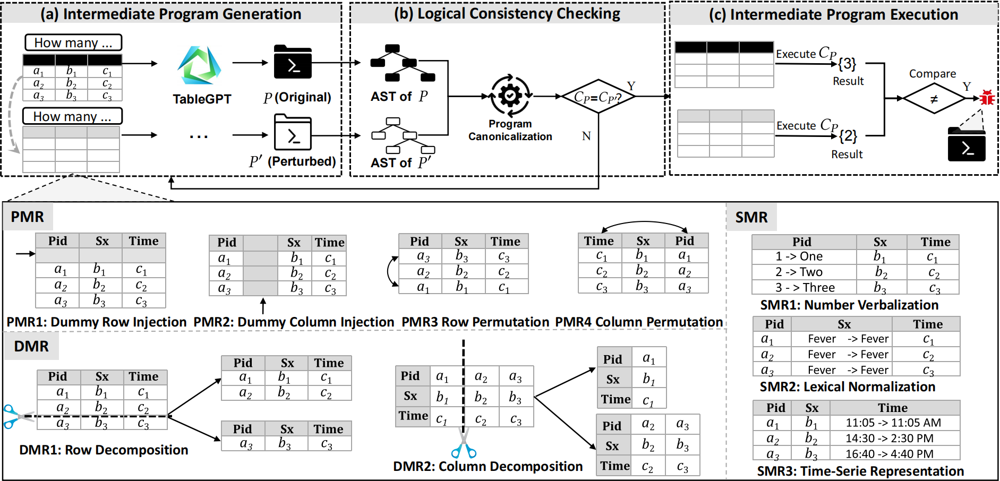

# MetaTab

This is the official guide for the paper *“Detecting Logic Errors in LM-Generated Programs for Tabular Data via Metamorphic Testing.”*  



---

## Requirements

- Python ≥ 3.10  
- Linux  

---

## Installation

Clone this repository and install the required dependencies:

```bash
pip install -r requirements.txt
```

---

## Usage

### 1. Data Preparation

Extract the dataset:

```bash
unzip assets/data.zip -d path/to/data
```

### 2. Model Setup

Set up the tabular language models locally:

- **TableGPT**: https://huggingface.co/tablegpt/TableGPT2-7B  
- **TableLLM**: https://huggingface.co/RUCKBReasoning/TableLLM-7b  

---

### 3. Step-by-Step Example (TableGPT)

#### Intermediate Program Generation (Original)

```bash
python run_tablegpt_agent.py \
    --model tablegpt \
    --dataset wtq --sub_sample False \
    --perturbation none --use_full_table True \
    --disable_resort True --norm_cache True \
    --resume 0 --stop_at 1e6 --self_consistency 5 --temperature 0.8 \
    --log_dir output/wtq_agent --cache_dir cache/tablegpt
```

#### Intermediate Program Generation (Perturbed)

---

### Permutation Metamorphic Relations (PMR)

- **PMR1: Shuffle**
```bash
python run_tablegpt_agent.py \
    --model tablegpt \
    --dataset wtq --sub_sample False \
    --perturbation shuffle --use_full_table True \
    --disable_resort True --norm_cache True \
    --resume 0 --stop_at 1e6 --self_consistency 5 --temperature 0.8 \
    --log_dir output/wtq_agent --cache_dir cache/tablegpt
```

- **PMR2: Column Shuffle**
```bash
python run_tablegpt_agent.py \
    --model tablegpt \
    --dataset wtq --sub_sample False \
    --perturbation column_shuffle --use_full_table True \
    --disable_resort True --norm_cache True \
    --resume 0 --stop_at 1e6 --self_consistency 5 --temperature 0.8 \
    --log_dir output/wtq_agent --cache_dir cache/tablegpt
```

- **PMR3: Transpose**
```bash
python run_tablegpt_agent.py \
    --model tablegpt \
    --dataset wtq --sub_sample False \
    --perturbation transpose --use_full_table True \
    --disable_resort True --norm_cache True \
    --resume 0 --stop_at 1e6 --self_consistency 5 --temperature 0.8 \
    --log_dir output/wtq_agent --cache_dir cache/tablegpt
```

- **PMR4: Reconstruction**
```bash
python run_reconstruction_tablegpt_agent.py \
    --model tablegpt \
    --dataset wtq --sub_sample False \
    --perturbation none --use_full_table True \
    --disable_resort True --norm_cache True \
    --resume 0 --stop_at 1e6 --self_consistency 5 --temperature 0.8 \
    --log_dir output/wtq_agent --cache_dir cache/tablegpt
```

---

### Decomposition Metamorphic Relations (DMR)

- **DMR1**
```bash
python run_tablegpt_agent_cut.py \
    --model tablegpt \
    --dataset wtq --sub_sample False \
    --perturbation none --use_full_table True \
    --disable_resort True --norm_cache True \
    --resume 0 --stop_at 1e6 --self_consistency 5 --temperature 0.8 \
    --log_dir output/wtq_agent --cache_dir cache/tablegpt
```

- **DMR2**
```bash
python run_tablegpt_agent_c_cut.py \
    --model tablegpt \
    --dataset wtq --sub_sample False \
    --perturbation none --use_full_table True \
    --disable_resort True --norm_cache True \
    --resume 0 --stop_at 1e6 --self_consistency 5 --temperature 0.8 \
    --log_dir output/wtq_agent --cache_dir cache/tablegpt
```

---

### Semantic Metamorphic Relations (SMR)

- **SMR1**
```bash
python Symbolization_pure_numbers_to_words.py
```

- **SMR2**
```bash
python Category_Anonymization.py
```

- **SMR3**
```bash
python filter_time_series_table.py
```

After preprocessing, run:

```bash
python run_tablegpt_agent.py \
    --model tablegpt \
    --dataset wtq --sub_sample False \
    --perturbation none --use_full_table True \
    --disable_resort True --norm_cache True \
    --resume 0 --stop_at 1e6 --self_consistency 5 --temperature 0.8 \
    --log_dir output/wtq_agent --cache_dir cache/tablegpt
```

---

## Evaluation

- **Error Rate**
```bash
python evaluate_agent_all_type.py
```

- **Recall, Precision, F1 Score**
```bash
python hhh_wtq.py
```

---

## Environment

- PyTorch  
