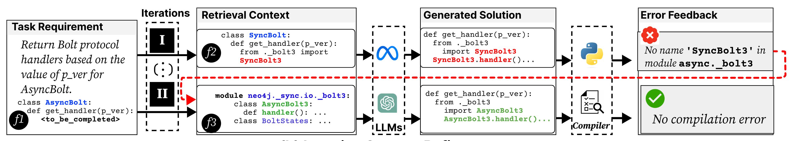

# CoCoGen

## Introduction
The code repository for anonymous ACL sumbission "Iterative Refinement of Project-Level Code Context for Precise Code Generation with Compiler Feedback"

CoCoGen is a framework to allow an LLM to leverage the code repository of a software project to enhance the quality of the generated code through compiler feedback.


## How CoCoGen Works

CoCoGen operates by iteratively refining LLM-generated code that leverages compiler feedback to identify and correct context-related errors:

1. **Code Generation**: Utilizing an LLM, CoCoGen generates an initial code sample aimed at a specific functionality within a software project.

2. **Compilation and Error Identification**: The generated code is then compiled. CoCoGen meticulously analyzes the compilation output to detect any context-related errors that might have arisen due to the lack of project-specific insights during the initial generation phase.

3. **Context Retrieval and Error Correction**: To address these errors, CoCoGen retrieves relevant context from the project's code repository. This context is then used to refine the generated code, correcting identified errors and aligning the solution more closely with the project's existing codebase and standards.

4. **Iterative Refinement**: This process of generation, compilation, error identification, and context-based correction repeats iteratively. With each cycle, the code moves closer to an error-free state that aligns with the project's context and requirements.


<!-- Directory Structure -->
## Directory Structure
The directory structure of this repository is shown as below:
```
.
├── assets                   # Resources for this README.md
├── requirements.txt         # Python requirements
├── running_scripts          # Example scripts to evaluate CoCoGen 
└── src
    ├── data                 # Datasets
    ├── main.py              # The main script of CoCoGen
    ├── RepoCoder.py         # Impelmentation of RepoCoder baseline
    └── vector_database      # pre-computed vector embeddings using the text-embedding-ada-002 model
```

## Setup Instructions
### Setting Up the Python Environment
**Create a Virtual Environment (Recommended)**: To isolate and manage the project's dependencies, we recommend setting up a virtual environment. If you're using Conda, you can create a new environment by running:

```bash
conda create --name cocogen python=3.8
conda activate cocogen
```

Alternatively, if you prefer using virtualenv, you can set up your environment with the following commands:

```bash
python -m venv cocogen
source cocogen/bin/activate
````

**Install Dependencies**: Install all required Python dependencies by executing:
```bash
pip install -r requirements.txt
```
Note: For torch installation, adjust the command according to your CUDA version to ensure compatibility. Visit the PyTorch official website for specific commands based on your setup.

### Preparing the Data
**Download Required Datasets and Databases**: Access the necessary CoderEval dataset, pre-built vector database, and structural database from the provided link:
[CoCoGen_data.tar.xz](https://drive.google.com/file/d/19MMuTiJreHdC7RosMw-DD3QnMuLJ-AhN/view?usp=sharing)


**Extract and Organize Data**: After downloading, extract the files and place them into the `src` directory within the project structure.


## Evaluation
### Running RepoCoder
To evaluate your model using RepoCoder, navigate to the running_scripts directory where the evaluation scripts are located. Use the following command to initiate the prediction process with RepoCoder:
bash
```
python RepoCoder.py --run_prediction --num_dev 230 --model code-llama --split python --num_iterations 3
```
- --num_iterations: Specifies the number of retrieval iterations to perform.
- --model: Defines the model to use. Options include code-llama and gpt-3.5-turbo.

### Running CoCoGen
  
For evaluations using CoCoGen, execute the following command:
```bash
python cocogen.py --run_prediction --num_dev 230 --model gpt-3.5-turbo --split python --num_iterations 3
```

### Computing the Pass@k Score
After running the predictions, results will be stored in the `misc` folder. 
To compute the Pass@k score for these results, follow the instructions provided by the CoderEval official repository:
https://github.com/CoderEval/CoderEval

Refer to the "evaluation process" section within the CoderEval repository. This process requires downloading and running a Docker environment to perform the evaluation accurately.


