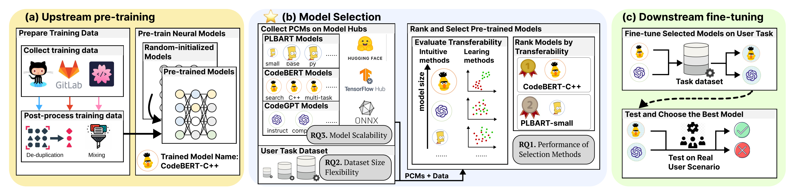
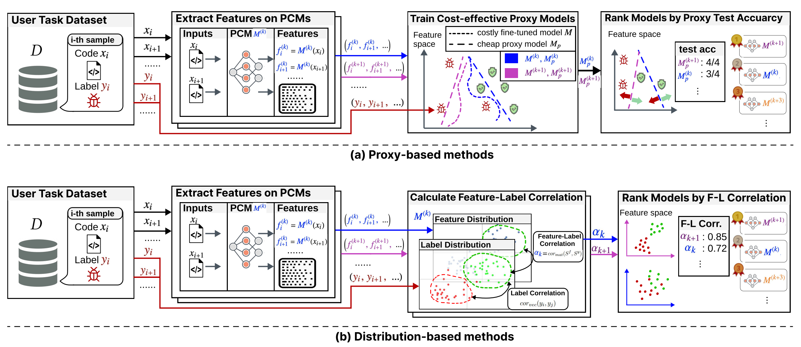

# How to Select Pre-Trained Code Models for Reuse? A Learning Perspective

This is the official code repository for the 32nd IEEE International Conference on Software Analysis, Evolution and Reengineering (SANER) submission titled "How to Select Pre-Trained Code Models for Reuse? A Learning Perspective." 
This repository includes a set of benchmarks designed to aid in the reuse of pre-trained source code models.




## What is the Model Selection Problem

Pre-trained models encapsulate a wealth of knowledge within their parameters, significantly benefiting code-related problem-solving. 
However, the utility of this pre-trained knowledge varies with the training dataset and the model’s design, affecting the performance of models on the task dataset. 
Model selection involves identifying the most appropriate pre-trained model for a specific task, aiming to maximize the use of pre-trained knowledge to achieve optimal performance.

### Intuitive Selection Methods

Intuitive methods rely solely on model metadata for selection, such as model size and training dataset size. 
While these methods are straightforward, they often lack accuracy as metadata does not fully reflect a model's performance capabilities.
Alternatively, one could fine-tune all models and choose the best performer; however, this method is time-consuming as it requires extensive fine-tuning.

### Learning-Based Selection Methods

Learning-based approaches delve into model parameters to select a model whose pre-trained knowledge best matches the task at hand.


#### 1. Proxy-based Model Selection

Proxy-based methods involve training cost-effective models that act as performance proxies for the original pre-trained code models.
These proxies can be implemented using linear models, SVMs, or $k$-NN algorithms.
A suitable PCM for a task produces high-quality latent representations of the input sequences.
This quality facilitates the training of proxies that can effectively mirror the performance of the original PCMs. 
By comparing these proxies, one can gauge the efficacy of different PCMs for specific tasks, allowing for an informed selection of the most appropriate model.


#### 2. Distribution-based Model Selection

A PCM is deemed suitable for a task when code features that are proximate in the PCM’s feature space share similar or identical labels in the task’s label space. 
Distribution-based methods evaluate the closeness between the model’s feature space distribution and the task's label space distribution to select the most suitable model.
 




## Repository Contents

- **Model List**: Names and links for the selected 100 pre-trained models.
- **Fine-tuning Scripts**: Scripts for fine-tuning models on tasks such as vulnerability detection, algorithm classification, and code language identification.
- **Selection Strategy Scripts**: Scripts for both proxy-based and distribution-based model selection strategies, including $k$-NN, Linear Classifier, SVM, H-Score, and PARC.


## Installing the Benchmark

To install, first clone this repo (the github link is anonymized):

```
git clone <xxxx>
cd code-reuse
```

Make sure your python version is at least 3.7. Then install the requirements:

```
pip install -r requirements.txt
```

And you're done!

## Evaluation

See `run.sh` for an example of how to perform evaluation:

```bash
#!/bin/bash
python run.py --task='devign' \
--models='microsoft/codebert-base' \
--selection_method='Linear' \
--budget=1000
```

the pre-trained model `microsoft/codebert-base` will be downloaded and cached from [Hugging Face](https://huggingface.co/microsoft/codebert-base).

See [model_list](./docs/model_list.txt) for the complete list of models we investigated.


## The Complete List of Investigated Pre-trained Code Models

### Model Architectures
#### Encoder-only Models

Encoder-only models utilize just the encoder component of the transformer architecture. They are designed primarily for tasks that involve understanding and representing the input text without necessarily generating new text. These models are adept at capturing contextual relationships within the input data.


Examples: BERT (Bidirectional Encoder Representations from Transformers), RoBERTa, ALBERT, DistilBERT.


#### Decoder-only Models

Decoder-only models use only the decoder part of the transformer architecture. They are primarily focused on generating text and are designed to predict the next word in a sequence, making them suitable for language modeling tasks where the goal is to produce coherent and contextually relevant text.

Examples: GPT series (GPT, GPT-2, GPT-3, GPT-4), OpenAI's ChatGPT.

#### Encoder-Decoder Models

Encoder-decoder models incorporate both the encoder and decoder components of the transformer architecture. These models are designed for sequence-to-sequence tasks where an input sequence needs to be transformed into an output sequence. The encoder processes the input data to create a context-rich representation, which the decoder then uses to generate the output sequence.

Examples: The original Transformer model from "Attention is All You Need," T5 (Text-to-Text Transfer Transformer), BART (Bidirectional and Auto-Regressive Transformers), mBART.


### The Complete List of Investigated Models

| Model Architecture | Number of Parameters  | URL                                                                                                |
|--------------------|-----------------------|----------------------------------------------------------------------------------------------------|
| Encoder-Decoder    |  42M                  |  https://huggingface.co/formermagic/codet5x-small                                                  |
| Encoder-Decoder    |  42M                  |  https://huggingface.co/Salesforce/codet5-small                                                    |
| Encoder-Decoder    |  42M                  |  https://huggingface.co/SEBIS/code_trans_t5_base_api_generation                                    |
| Encoder-Decoder    |  42M                  |  https://huggingface.co/SEBIS/code_trans_t5_base_code_comment_generation_java                      |
| Encoder-Decoder    |  42M                  |  https://huggingface.co/SEBIS/code_trans_t5_base_code_documentation_generation_go                  |
| Encoder-Decoder    |  42M                  |  https://huggingface.co/SEBIS/code_trans_t5_base_code_documentation_generation_java                |
| Encoder-Decoder    |  42M                  |  https://huggingface.co/SEBIS/code_trans_t5_base_code_documentation_generation_javascript          |
| Encoder-Decoder    |  42M                  |  https://huggingface.co/SEBIS/code_trans_t5_base_code_documentation_generation_php                 |
| Encoder-Decoder    |  42M                  |  https://huggingface.co/SEBIS/code_trans_t5_base_code_documentation_generation_python              |
| Encoder-Decoder    |  42M                  |  https://huggingface.co/SEBIS/code_trans_t5_base_code_documentation_generation_ruby                |
| Encoder-Decoder    |  42M                  |  https://huggingface.co/SEBIS/code_trans_t5_base_commit_generation                                 |
| Encoder-Decoder    |  42M                  |  https://huggingface.co/SEBIS/code_trans_t5_base_program_synthese                                  |
| Encoder-Decoder    |  42M                  |  https://huggingface.co/SEBIS/code_trans_t5_base_source_code_summarization_csharp                  |
| Encoder-Decoder    |  42M                  |  https://huggingface.co/SEBIS/code_trans_t5_base_source_code_summarization_python                  |
| Encoder-Decoder    |  42M                  |  https://huggingface.co/SEBIS/code_trans_t5_base_source_code_summarization_sql                     |
| Encoder-Decoder    |  42M                  |  https://huggingface.co/SEBIS/code_trans_t5_base_transfer_learning_pretrain                        |
| Encoder-Decoder    |  42M                  |  https://huggingface.co/SEBIS/code_trans_t5_small_api_generation                                   |
| Encoder-Decoder    |  42M                  |  https://huggingface.co/SEBIS/code_trans_t5_small_code_comment_generation_java                     |
| Encoder-Decoder    |  42M                  |  https://huggingface.co/SEBIS/code_trans_t5_small_code_documentation_generation_go                 |
| Encoder-Decoder    |  42M                  |  https://huggingface.co/SEBIS/code_trans_t5_small_code_documentation_generation_java               |
| Encoder-Decoder    |  42M                  |  https://huggingface.co/SEBIS/code_trans_t5_small_code_documentation_generation_javascript         |
| Encoder-Decoder    |  42M                  |  https://huggingface.co/SEBIS/code_trans_t5_small_code_documentation_generation_php                |
| Encoder-Decoder    |  42M                  |  https://huggingface.co/SEBIS/code_trans_t5_small_code_documentation_generation_python             |
| Encoder-Decoder    |  42M                  |  https://huggingface.co/SEBIS/code_trans_t5_small_code_documentation_generation_ruby               |
| Encoder-Decoder    |  42M                  |  https://huggingface.co/SEBIS/code_trans_t5_small_commit_generation                                |
| Encoder-Decoder    |  42M                  |  https://huggingface.co/SEBIS/code_trans_t5_small_program_synthese                                 |
| Encoder-Decoder    |  42M                  |  https://huggingface.co/SEBIS/code_trans_t5_small_source_code_summarization_csharp                 |
| Encoder-Decoder    |  42M                  |  https://huggingface.co/SEBIS/code_trans_t5_small_source_code_summarization_python                 |
| Encoder-Decoder    |  42M                  |  https://huggingface.co/SEBIS/code_trans_t5_small_source_code_summarization_sql                    |
| Encoder-Decoder    |  42M                  |  https://huggingface.co/SEBIS/code_trans_t5_small_transfer_learning_pretrain                       |
| Encoder-only       |  58M                  |  https://huggingface.co/huggingface/CodeBERTa-language-id                                          |
| Encoder-only       |  58M                  |  https://huggingface.co/huggingface/CodeBERTa-small-v1                                             |
| Encoder-only       |  58M                  |  https://huggingface.co/mrm8488/codeBERTaJS                                                        |
| Encoder-only       |  58M                  |  https://huggingface.co/mrm8488/CodeBERTaPy                                                        |
| Encoder-only       |  87M                  |  https://huggingface.co/microsoft/codebert-base                                                    |
| Encoder-only       |  87M                  |  https://huggingface.co/microsoft/codebert-base-mlm                                                |
| Encoder-only       |  87M                  |  https://huggingface.co/microsoft/codereviewer                                                     |
| Encoder-only       |  87M                  |  https://huggingface.co/microsoft/unixcoder-base                                                   |
| Encoder-only       |  87M                  |  https://huggingface.co/microsoft/unixcoder-base-nine                                              |
| Encoder-only       |  87M                  |  https://huggingface.co/microsoft/unixcoder-base-unimodal                                          |
| Encoder-only       |  87M                  |  https://huggingface.co/mrm8488/codebert2codebert-finetuned-code-defect-detection                  |
| Encoder-only       |  87M                  |  https://huggingface.co/mrm8488/codebert-base-finetuned-code-ner                                   |
| Encoder-only       |  87M                  |  https://huggingface.co/mrm8488/codebert-base-finetuned-code-ner-15e                               |
| Encoder-only       |  87M                  |  https://huggingface.co/mrm8488/codebert-base-finetuned-detect-insecure-code                       |
| Encoder-only       |  87M                  |  https://huggingface.co/mrm8488/codebert-base-finetuned-stackoverflow-ner                          |
| Encoder-only       |  87M                  |  https://huggingface.co/neulab/codebert-c                                                          |
| Encoder-only       |  87M                  |  https://huggingface.co/neulab/codebert-cpp                                                        |
| Encoder-only       |  87M                  |  https://huggingface.co/neulab/codebert-java                                                       |
| Encoder-only       |  87M                  |  https://huggingface.co/neulab/codebert-javascript                                                 |
| Encoder-only       |  87M                  |  https://huggingface.co/neulab/codebert-python                                                     |
| Encoder-only       |  88M                  |  https://huggingface.co/codeparrot/unixcoder-java-complexity-prediction                            |
| Encoder-Decoder    |  97M                  |  https://huggingface.co/uclanlp/plbart-base                                                        |
| Encoder-Decoder    |  97M                  |  https://huggingface.co/uclanlp/plbart-cs-java                                                     |
| Encoder-Decoder    |  97M                  |  https://huggingface.co/uclanlp/plbart-csnet                                                       |
| Encoder-Decoder    |  97M                  |  https://huggingface.co/uclanlp/plbart-en_XX-java                                                  |
| Encoder-Decoder    |  97M                  |  https://huggingface.co/uclanlp/plbart-go-en_XX                                                    |
| Encoder-Decoder    |  97M                  |  https://huggingface.co/uclanlp/plbart-java-cs                                                     |
| Encoder-Decoder    |  97M                  |  https://huggingface.co/uclanlp/plbart-java-en_XX                                                  |
| Encoder-Decoder    |  97M                  |  https://huggingface.co/uclanlp/plbart-javascript-en_XX                                            |
| Encoder-Decoder    |  97M                  |  https://huggingface.co/uclanlp/plbart-multi_task-all                                              |
| Encoder-Decoder    |  97M                  |  https://huggingface.co/uclanlp/plbart-multi_task-compiled                                         |
| Encoder-Decoder    |  97M                  |  https://huggingface.co/uclanlp/plbart-multi_task-dynamic                                          |
| Encoder-Decoder    |  97M                  |  https://huggingface.co/uclanlp/plbart-multi_task-go                                               |
| Encoder-Decoder    |  97M                  |  https://huggingface.co/uclanlp/plbart-python-en_XX                                                |
| Encoder-Decoder    |  97M                  |  https://huggingface.co/uclanlp/plbart-refine-java-medium                                          |
| Encoder-Decoder    |  97M                  |  https://huggingface.co/uclanlp/plbart-refine-java-small                                           |
| Encoder-Decoder    |  97M                  |  https://huggingface.co/uclanlp/plbart-ruby-en_XX                                                  |
| Encoder-Decoder    |  97M                  |  https://huggingface.co/uclanlp/plbart-single_task-static-generation                               |
| Encoder-Decoder    |  97M                  |  https://huggingface.co/uclanlp/plbart-single_task-static-summarization                            |
| Encoder-Decoder    |  97M                  |  https://huggingface.co/uclanlp/plbart-single_task-strong-generation                               |
| Encoder-Decoder    |  97M                  |  https://huggingface.co/uclanlp/plbart-single_task-strong-summarization                            |
| Encoder-Decoder    |  97M                  |  https://huggingface.co/uclanlp/plbart-single_task-weak-generation                                 |
| Encoder-Decoder    |  97M                  |  https://huggingface.co/uclanlp/plbart-single_task-weak-summarization                              |
| Encoder-Decoder    |  97M                  |  https://huggingface.co/alexjercan/codet5-base-buggy-error-description                             |
| Encoder-Decoder    |  97M                  |  https://huggingface.co/Rivenatte/summarize_ruby_codet5_base                                       |
| Encoder-Decoder    |  97M                  |  https://huggingface.co/Anonymous2023/codet5-base-kg                                               |
| Encoder-Decoder    |  97M                  |  https://huggingface.co/cjwilliams/codet5-base-python-sum                                          |
| Encoder-Decoder    |  97M                  |  https://huggingface.co/Salesforce/codet5-base-codexglue-sum-python                                |
| Encoder-Decoder    |  97M                  |  https://huggingface.co/Salesforce/codet5-base-codexglue-sum-java                                  |
| Encoder-Decoder    |  97M                  |  https://huggingface.co/Salesforce/codet5-base-codexglue-sum-go                                    |
| Encoder-Decoder    |  97M                  |  https://huggingface.co/Salesforce/codet5-base-codexglue-sum-javascript                            |
| Encoder-Decoder    |  97M                  |  https://huggingface.co/Salesforce/codet5-base-codexglue-sum-php                                   |
| Encoder-Decoder    |  97M                  |  https://huggingface.co/Salesforce/codet5-base-codexglue-sum-ruby                                  |
| Encoder-Decoder    |  156M                 |  https://huggingface.co/Salesforce/codet5-base                                                     |
| Encoder-Decoder    |  156M                 |  https://huggingface.co/Salesforce/codet5-base-codexglue-clone                                     |
| Encoder-Decoder    |  156M                 |  https://huggingface.co/Salesforce/codet5-base-codexglue-concode                                   |
| Encoder-Decoder    |  156M                 |  https://huggingface.co/Salesforce/codet5-base-codexglue-defect                                    |
| Encoder-Decoder    |  156M                 |  https://huggingface.co/Salesforce/codet5-base-codexglue-refine-medium                             |
| Encoder-Decoder    |  156M                 |  https://huggingface.co/Salesforce/codet5-base-codexglue-refine-small                              |
| Encoder-Decoder    |  156M                 |  https://huggingface.co/Salesforce/codet5-base-codexglue-translate-cs-java                         |
| Encoder-Decoder    |  156M                 |  https://huggingface.co/Salesforce/codet5-base-codexglue-translate-java-cs                         |
| Encoder-Decoder    |  156M                 |  https://huggingface.co/nchen909/codet5-base-finetuned-clone-detection                             |
| Encoder-Decoder    |  156M                 |  https://huggingface.co/Patcas/codet5-base-step-1                                                  |
| Encoder-Decoder    |  156M                 |  https://huggingface.co/Patcas/codet5Basedoc-step-1                                                |
| Encoder-Decoder    |  156M                 |  https://huggingface.co/Patcas/codet5Basedoc-step-2                                                |
| Encoder-Decoder    |  156M                 |  https://huggingface.co/Salesforce/codet5-base-multi-sum                                           |
| Encoder-Decoder    |  285M                 |  https://huggingface.co/uclanlp/plbart-large                                                       |
| Decoder-only       |  1B                   |  https://huggingface.co/bigcode/starcoderbase-1b                                                   |
| Encoder-Decoder    |  2B                   |  https://huggingface.co/Salesforce/codet5p-2b                                                      |
| Decoder-only       |  3B                   |  https://huggingface.co/bigcode/starcoderbase-3b                                                   |