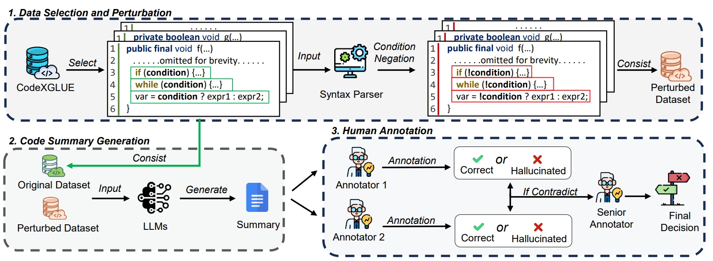
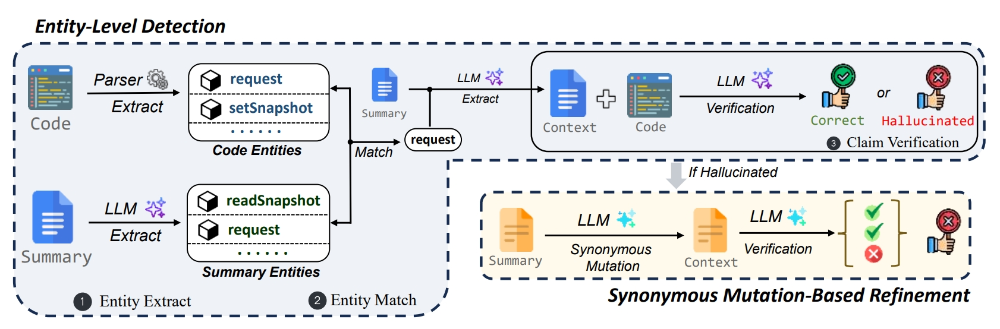
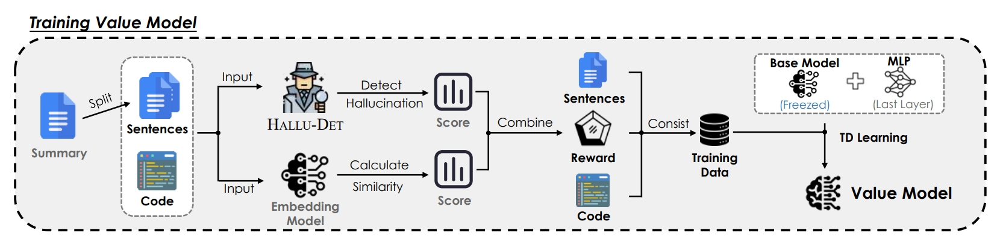
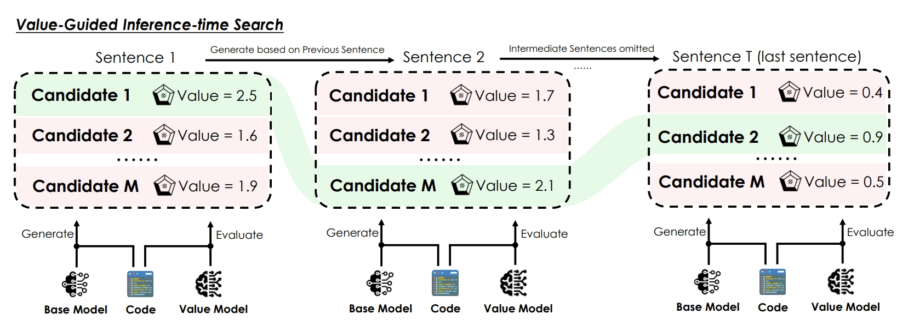

# Hallucinations in LLM-Based Code Summarization: Unveiling, Detection, and Mitigation

Welcome to our repository 🌟. Here, we provide a PyTorch implementation for **our FSE'26 paper 📚 "Hallucinations in LLM-Based Code Summarization: Unveiling, Detection, and Mitigation"**.

We're delighted to share our work with the community and encourage collaborative exploration and discussion. 




**Repository Overview:**

- [Environment Configuration](#Environment-Configuration) - Guides on setting up the necessary environment to run our code.

- [HALLU-EVAL](#HALLU-EVAL) - Notice on how to use our dataset **HALLU-EVAL**.

- [HALLU-DET](#HALLU-DET) - Steps to use our hallucination detection framework **HALLU-DET**.

- [HALLU-SHIELD](#HALLU-SHIELD) - Steps to train the value model and conduct value-guided summary generation.


## Environment Configuration


Here we provide the configuration file of our conda environment, which is in `environment.yml`.

You can install the conda environment via:

```
conda env create -f environment.yml
```


### HALLU-EVAL

Here we provide the detail information of dataset **HALLU-EVAL**:

The dataset is in `./dataset/HALLU-EVAL`, where we provide two files: `HALLU-EVAL(Easy).jsonl` and `HALLU-EVAL(Hard).jsonl`, corresponding to the two datasets we mentioned in our paper.

Besides, we also provide the summary to HALLU-EVAL which is generated by language models (`Qwen2.5-Coder-7B`, `Qwen2.5-Coder-14B`, `CodeLlama-7B`, `CodeLlama-13B`). These summaries are available at `./dataset/Summary-on-HALLU-EVAL`.


### HALLU-DET



Here we provide the detail information of our hallucination detection framework **HALLU-DET**.

Prepare your data in the format of:

```
{"code":xxx, "summary":xxx}
```

Then run

```shell
python ./HALLU-DET/Entity-Level-Detection.py
python ./HALLU-DET/Synonymous-Mutation-Based-Refinement.py
```

You may need to configure your own api key to use the LLM service. The output format would be:

```
{"code":xxx, "summary":xxx, "decision":xxx}
```

The summary is regarded as hallucinated when `decision=false`, and vice versa.


### HALLU-SHIELD

Here we provide the detail of our hallucination mitigation framework **HALLU-SHIELD**.

This frameworks involves two stages. First we need to train the value model：



Prepare the training data in the format of:

```
{"code":xxx, "sentence":[xxx,xxx,...], "values":[xxx,xxx,...]}
```

where the value in the value list represent the value of the corresponding sentence.

Once the training data is prepared, you can start training value model via

```shell
torchrun --nproc_per_node=7 ./Finetune_Hallu_Value.py
```

This may take several hours, and once this is completed, we could proceed to the next stage.



In this part, we are going to use the trained **HALLU-VALUE** to guide the model to generate better summary.

Run the following python script to generate code summary with **HALLU-SHIELD**:

```
python ./HALLU-SHIELD/ Value-Guided-Summary-Generation.py
```

The value model trained in previous stage would be involved in this part. Your input file in this part should be in the format of:

```
{"code":xxx}
```

And this would give you an output file in the format of

```
{"code":xxx, "summary":xxx}
```

which represents the summary generated by our framework.


**🚨 Hardware Configuration**

We run all experiments on a standard server equipped with 8 **NVIDIA H800 Tensor Core GPUs**. Thank you for your time of reading this document.
