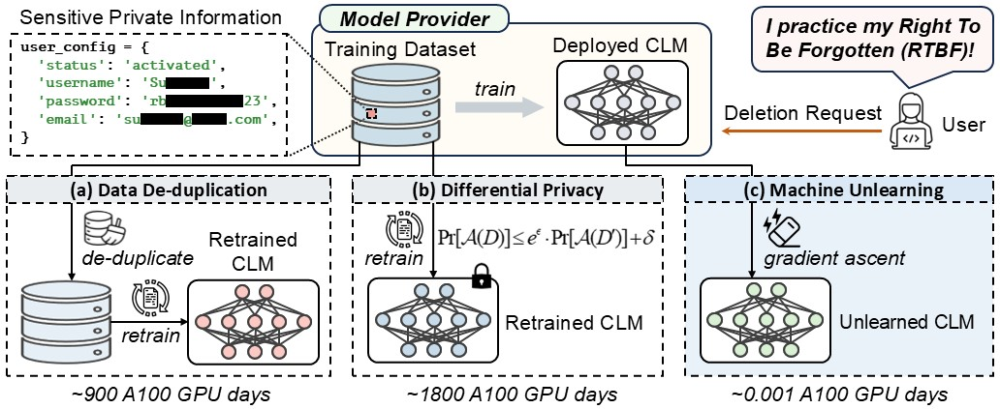
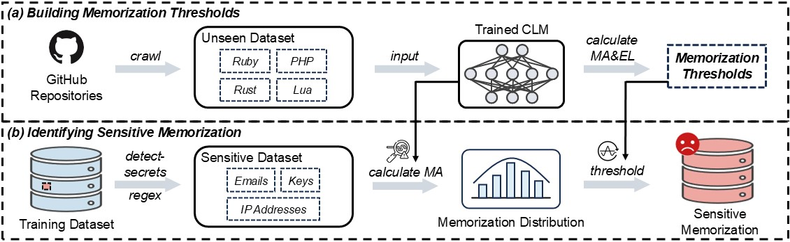
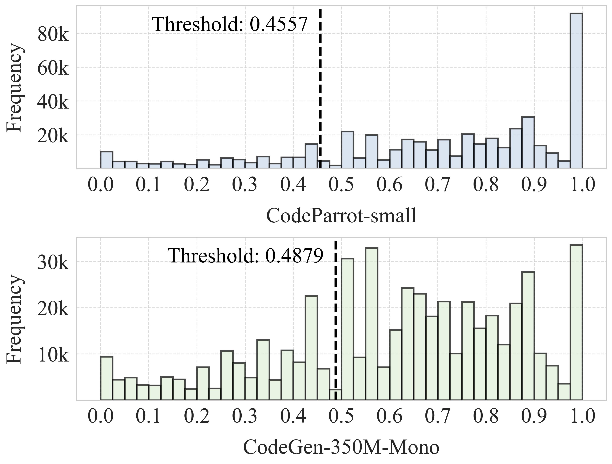
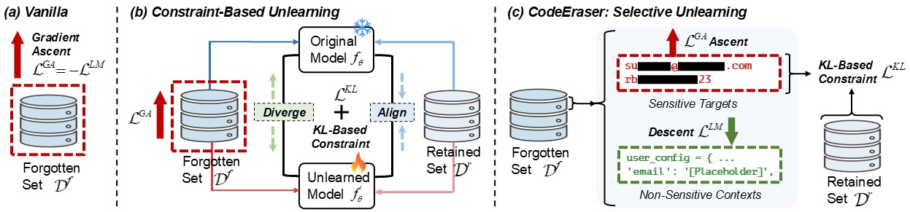

# Code Unlearning: Implementation of Machine Unlearning in Code Language Models

Welcome to the **Code Unlearning** repository 🌟! Here, we provide a PyTorch implementation for our ICSE'26 paper 📚 titled "Scrub It Out! Erasing Sensitive Memorization in Code Language Models via Machine Unlearning". 
Our work focuses on a novel approach to reduce specific sensitive memorization within Code Language Models (CLMs), contributing to the field of ethical software engineering. 

We invite the community to engage with our findings and methodology. For any issues or inquiries regarding the code, please utilize the `Issues` section for support. Our implementation has also been presented at [https://github.com/Zhaoyang-Chu/code-unlearning](https://github.com/Zhaoyang-Chu/code-unlearning).



**Repository Overview:**
- [Environment Configuration](#environment-configuration) - Instructions for setting up the necessary environment to run our code.
- [Sensitive Memorization Detection](#sensitive-memorization-detection) -  A detailed process for curating a **Sensitive Memorization Dataset** for CLMs by quantifying memorization risks of sensitive data in the CLM’s training dataset and identifying high-risk instances targeted for unlearning.
- [Selective Unlearning](#selective-unlearning) - Code scripts for enabling CLMs to selectively forget specific sensitive information embedded in code while maintaining overall model utility.

## Environment Configuration

### CUDA Dependencies

Our project requires specific versions of the CUDA Toolkit and cuDNN. Ensure you have the following versions installed:
- **CUDA Toolkit**: Version 11.8.0
- **cuDNN**: Version 8.8.1 (compatible with CUDA 11.x)

To set things up:
1. Download the required versions:
    - [CUDA Toolkit Archive](https://developer.nvidia.com/cuda-toolkit-archive)
    - [cuDNN Archive](https://developer.nvidia.com/rdp/cudnn-archive)
2. Installing CUDA:
    ```shell
    sudo sh cuda_11.8.0_520.61.05_linux.run
    ```
3. Setting up cuDNN:
    ```shell
    tar xf cudnn-linux-x86_64-8.8.1.3_cuda11-archive.tar.xz
    sudo cp cudnn-linux-x86_64-8.8.1.3_cuda11-archive/include/cudnn.h  /usr/local/cuda-11.8/include
    sudo cp cudnn-linux-x86_64-8.8.1.3_cuda11-archive/lib/libcudnn*  /usr/local/cuda-11.8/lib64
    sudo chmod a+r /usr/local/cuda-11.8/include/cudnn.h  /usr/local/cuda-11.8/lib64/libcudnn*
    ```
4. Configuring environment variables:
    ```shell
    export LD_LIBRARY_PATH=$LD_LIBRARY_PATH:/usr/local/cuda-11.8/lib64
    export PATH=$PATH:/usr/local/cuda-11.8/bin
    export CUDA_HOME=$CUDA_HOME:/usr/local/cuda-11.8
    ```

### Python Library Dependencies

Start by creating a Conda environment:
```shell
conda create -n code-unlearning python=3.9
conda activate code-unlearning
```

Install the necessary Python packages:
```shell
pip install https://download.pytorch.org/whl/cu118/torch-2.0.1%2Bcu118-cp39-cp39-linux_x86_64.whl
pip install transformers==4.33.2
pip install pytorch-lightning==2.1.2
pip install pandas==2.1.1
pip install numpy==1.26.0
pip install nlp==0.4.0
pip install sentencepiece==0.1.94
pip install nltk==3.8.1
pip install deepspeed==0.12.0
pip install boto3==1.28.52
pip install rouge==1.0.1
pip install lm-eval==0.3.0
pip install torchmetrics==1.1.2
pip install accelerate==0.23.0
pip install detect-secrets
pip install feather-format
pip install pyarrow
pip install tqdm
pip install datasets
pip install gibberish-detector
pip install huggingface-hub
pip install seaborn
```

To enable iterative training in the `PyTorch Lightning` framework, please modify the code in the `<your path>/anaconda3/envs/code-unlearning/lib/python3.9/site-packages/pytorch_lightning/loops/fit_loop.py` by commenting the lines from 352 to 356, as follows:
```python
def advance(self) -> None:
    """Runs one whole epoch."""
    log.debug(f"{type(self).__name__}: advancing loop")

    combined_loader = self._combined_loader
    assert combined_loader is not None
    # if combined_loader._mode == "sequential":  # commenting
    #     raise ValueError(  # commenting
    #         f'`{type(self).__name__}` does not support the `CombinedLoader(mode="sequential")` mode.'  # Comment
    #         f" The available modes are: {[m for m in _SUPPORTED_MODES if m != 'sequential']}"  # commenting
    #     )  # commenting
    with self.trainer.profiler.profile("run_training_epoch"):
        assert self._data_fetcher is not None
        self.epoch_loop.run(self._data_fetcher)
```
This modification allows `PyTorch Lightning` to support the custom iterative training process required by our project.

### Additional Settings

1. Configure the directory where Hugging Face datasets and models will be cached:
    ```shell
    export HF_HOME=<path_to_your_hf_cache_directory>
    ```
    Replace <path_to_your_hf_cache_directory> with the actual path where you'd like Hugging Face to store its cache data.
2. Disable parallelism in tokenizers to avoid potential conflicts with multiprocessing:
    ```shell
    export TOKENIZERS_PARALLELISM=false
    ```
3. Specify which GPUs should be visible to and used by CUDA:
    ```shell
    export CUDA_VISIBLE_DEVICES=0,1,2,3
    ```
    Adjust the numbers based on the available GPUs you intend to use. 
4. Run the Accelerate configuration command to set up your preferred environment for distributed and mixed-precision training:
    ```shell
    accelerate config
    ```
    Follow the prompts to configure `Accelerate` according to your specific hardware setup.
5. Login to your `huggingface-hub` account:
    ```shell
    huggingface-cli login
    ```
6. Download and cache the studied models including CodeParrot and CodeGen:
    ```shell
    python cache_models.py
    ```

## Sensitive Memorization Detection

In our study, we establish a systematic pipeline specifically designed to identify and quantify sensitive memorization within CLMs. 
This pipeline underpins the creation of a novel dataset containing extracted sensitive memorization data, which is instrumental for further research.



### Building Memorization Thresholds

Firstly, we curate a new dataset by crawling GitHub for code that was not previously seen by the CLM during its training phase. 
On this unseen dataset, we calculate memorization scores using the MA and $\text{EL}_n$ metrics to establish benchmarks known as memorization thresholds, which help identify highly memorized data.

#### Data Collection

To compile the unseen dataset $\mathcal{D}^\prime$ used in our work, we employ a data crawling tool available at [link](https://github.com/VHellendoorn/Code-LMs/tree/main/Data).
Based on this tool, we conduct the following pipeline for data collection: 
1. Navigate to `memorization_thresholds` directory. 
2. Update the `gh_crawler.py` file by adding your GitHub API token at line 7. This file allows us to collect GitHub repositories (written in Ruby, PHP, Rust, and Lua) that have at least 500 stars and were created later than the release dates of CodeParrot and CodeGen. The crawled repositories are listed in the `TopLists` directory.
3. Execute the `collect_data.sh` script, which performs the following tasks:
    1. Invokes the GitHub API crawler (`gh_crawler.py`).
    2. Executes the repository cloning script (`clone_repo.sh`) with `extract_code.py` to extract code files.
    3. Run `deduplicate.py` to eliminate duplicate files.
    
    Note: Due to the dynamic nature of GitHub's API responses, each execution of the `collect_data.sh` script may yield different results. 
    Thus, the exact replication of the unseen dataset is not guaranteed.
    Moreover, if the data collection process is interrupted or encounters errors, run the `bash clean.sh` command to clean up partial data and try crawling again. 

    In our study, the above process results in a collection of approximately 38,975 de-duplicated code files written in Ruby, PHP, Rust, and Lua.
4. From this collection, we randomly select 10,000 files to construct the unseened dataset $\mathcal{D}^\prime$, which is utilized to calculate the memorization thresholds of MA and $\text{EL}_n$:
    ```shell
    python sample.py
    ```
5. Additionally, for the `Qwen2.5-Coder-7B` model, we compile $\mathcal{D}^\prime$ from two popular evaluation datasets, i.e., HumanEval and MBPP , which have been explicitly excluded from the CLM's training corpus via data decontamination:
    ```shell
    python humaneval_mbpp_get.py
    ```

#### Memorization Calculation

Next, we empirically establish memorization thresholds for MA and $\text{EL}_n$. Taking the `Salesforce/codegen-2B-mono` and `Qwen/Qwen2.5-Coder-7B` models as an example, we evaluate them on the unseen datasets located at `unlearning/data/github/unseen_data.csv` and `unlearning/data/human_eval_and_mbpp/unseen_data.csv`, respectively, calculating the average values of MA, $\text{EL}_3$, $\text{EL}_{5}$, and $\text{EL}_{10}$ over five runs:
```shell
cd unlearning
# Evaluate on data/github/unseen_data.csv (similar commands for other models)
python main.py --fp16 --unlearning_mode Original --valid_set data/github/unseen_data.csv --model_name_or_path Salesforce/codegen-2B-mono --ngpu 4 --eval_batch_size 100 --check_validation_only --el_n 3
python main.py --fp16 --unlearning_mode Original --valid_set data/github/unseen_data.csv --model_name_or_path Salesforce/codegen-2B-mono --ngpu 4 --eval_batch_size 100 --check_validation_only --el_n 5
python main.py --fp16 --unlearning_mode Original --valid_set data/github/unseen_data.csv --model_name_or_path Salesforce/codegen-2B-mono --ngpu 4 --eval_batch_size 100 --check_validation_only --el_n 10

python main.py --fp16 --unlearning_mode Original --valid_set data/human_eval_and_mbpp/unseen_data.csv --model_name_or_path Qwen/Qwen2.5-Coder-7B --ngpu 4 --eval_batch_size 100 --check_validation_only --el_n 3
python main.py --fp16 --unlearning_mode Original --valid_set data/human_eval_and_mbpp/unseen_data.csv --model_name_or_path Qwen/Qwen2.5-Coder-7B --ngpu 4 --eval_batch_size 100 --check_validation_only --el_n 5
python main.py --fp16 --unlearning_mode Original --valid_set data/human_eval_and_mbpp/unseen_data.csv --model_name_or_path Qwen/Qwen2.5-Coder-7B --ngpu 4 --eval_batch_size 100 --check_validation_only --el_n 10
```
In our study, the calculated memorization thresholds for MA, $\text{EL}_3$, $\text{EL}_{5}$, and $\text{EL}_{10}$ serve as empirical benchmarks indicating successful unlearning, as detailed in the following table.
Accordingly, a token sequence achieves the "forgotten" status when its memorization scores fall below these thresholds. 
Conversely, if a sequence exhibits memorization scores above these thresholds, it suggests potential risks of exposure and leakage, raising privacy and security concerns.

| CLM               | MA (%) Threshold | $\textbf{EL}_\textbf{3}$ (%) Threshold | $\textbf{EL}_\textbf{5}$ (%) Threshold | $\textbf{EL}_\textbf{10}$ (%) Threshold |
| ----------------- | ------------ | --------------- | --------------- | -------------------- |
| CodeParrot-small  | 45.57        | 17.66           | 10.82           | 5.49                 |
| CodeParrot        | 46.34        | 16.56           | 10.17           | 5.14                 |
| CodeGen-350M-Mono | 48.79        | 18.24           | 11.03           | 5.92                 |
| CodeGen-2B-Mono   | 53.61        | 19.32           | 11.71           | 6.28                 |
| Qwen/Qwen2.5-Coder-7B   | 40.99        | 15.65           | 12.45           | 8.82                 |

### Identifying Sensitive Memorization

We perform a comprehensive and systematic memorization analysis of sensitive data within the CLM's training dataset utilizing the MA metric.
Our process compiles high-risk instances with memorization scores excedding established memorization thresholds into the sensitive memorization dataset.

#### Sensitive Data Identification

Our analysis specifically targets the detection of explicitly identifiable sensitive data, such as emails, IP addresses, and API/SSH keys, within the `codeparrot-clean-train` dataset. 
To accurately identify such sensitive data, we employ a detection tool available at [link](https://github.com/bigcode-project/pii-lib).
Based on this tool, we conduct the following steps for sensitive data identification: 
1. Navigate to `sensitive_memorization` directory. 
2. Run the command below to detect emails and IP addresses using regular expressions, and API/SSH keys using the [detect-secrets](https://github.com/Yelp/detect-secrets) tool:
    ```shell
    python main.py --dataset_name codeparrot/codeparrot-clean-train --split train --cache_dir ./.codeparrot-clean-train-cache --batch_size 1000 --num_proc 48 --save_path_disk codeparrot-clean-train-secrets
    ```
3. Execute the following command to filter out local IPs and emails containing "example":
    ```shell
    python filter.py
    ```

Through this process, among the total of 5,300,000 training samples, we identify 939,665 samples (approximately 18%) that contain sensitive information.

#### Sensitive Memorization Quantification

We then quantify the memorization of these identified sensitive data by computing average MA scores for sensitive segments within each sample.
For example, the following figure depicts the memorization distribution across sensitive data for the `codeparrot/codeparrot-small` and `Salesforce/codegen-350M-mono` models.
It highlights that a large number of instances are flagged as high-risk ones above the established memorization threshold.



Perform the following steps to conduct sensitive memorization quantification for the studied models:
1. Generate masks for secrets within the token sequence of each code instance:
    ```shell
    python generate_secret_mask.py --model_name_or_path codeparrot/codeparrot  # for codeparrot/codeparrot-small and codeparrot/codeparrot
    python generate_secret_mask.py --model_name_or_path Salesforce/codegen-2B-mono  # for Salesforce/codegen-350M-mono and Salesforce/codegen-2B-mono
    python generate_secret_mask.py --model_name_or_path Qwen/Qwen2.5-Coder-7B  # for Qwen/Qwen2.5-Coder-7B
    ```
2. Tokenize secrets and their corresponding contexts/prefixes:
    ```shell
    python tokenize_secrets_and_prefixes.py --model_name_or_path codeparrot/codeparrot  # for codeparrot/codeparrot-small and codeparrot/codeparrot
    python tokenize_secrets_and_prefixes.py --model_name_or_path Salesforce/codegen-2B-mono  # for Salesforce/codegen-350M-mono and Salesforce/codegen-2B-mono
    python tokenize_secrets_and_prefixes.py --model_name_or_path Qwen/Qwen2.5-Coder-7B  # for Qwen/Qwen2.5-Coder-7B
    ```
3. Calculate MA scores of secrets for the `codeparrot/codeparrot-small` and `Salesforce/codegen-350M-mono` models:
    ```shell
    python probe.py --model_name_or_path codeparrot/codeparrot-small --fp16 --gpu_id 0 --batch_size 100
    python probe.py --model_name_or_path Salesforce/codegen-350M-mono --fp16 --gpu_id 0 --batch_size 50
    python probe.py --model_name_or_path codeparrot/codeparrot --fp16 --gpu_id 0 --batch_size 16
    python probe.py --model_name_or_path Salesforce/codegen-2B-mono --fp16 --gpu_id 0 --batch_size 8
    python probe.py --model_name_or_path Qwen/Qwen2.5-Coder-7B --fp16 --gpu_id 0 --batch_size 4
    ```
4. Analyze and characterize the memorization distribution across sensitive data:
    ```shell
    python analyze.py
    ```

Through this process, for each studied CLM, we ultimately collect 10,000 highly memorized sensitive samples (e.g., $\text{MA} \ge 0.9$), resulting in **50,000** samples in total.
We compile them into a **Sensitive Memorization Dataset**, which documents the positions of all sensitive segments within each code sample along with their corresponding memorization scores. 
This dataset serves as the foundation for targeted unlearning strategies to mitigate memorization and exposure risks.

## Selective Unlearning

In our work, we introduce **CodeEraser**, an innovative solution for selectively erasing sensitive memorization within CLMs through machine unlearning while preserving overall model utility.
We use the `Salesforce/codegen-2B-mono` model as an example to illustrate the implementation of CodeEraser in the following.



### Forgotten Sets and Retained Sets

For the `Salesforce/codegen-2B-mono` model, we perform five randomly sampling of $k=32$ instances from its sensitive memorization dataset `sensitive_memorization/codeparrot-clean-train-secrets-probed-codegen-2B-mono` as the forgotten sets to be unlearned:
```shell
cd unlearning_preparation
python forgotten_data_sample.py --model_name_or_path Salesforce/codegen-2B-mono --k 32
```

Then, we built the retained set to include non-targeted, non-sensitive data for measuring the CLM’s memorization retention post-unlearning.
We leverage a [code benchmark](https://github.com/AISE-TUDelft/LLM4Code-extraction/blob/main/benchmark.feather) provided by "[Traces of Memorisation in Large Language Models for Code](https://arxiv.org/abs/2312.11658)", which offers 1,000 non-sensitive samples from BigQuery. 
These samples have been shown to be memorized by various CLMs, such as CodeParrot, CodeGen, and InCoder, making them suitable for building the retained set. 
Specifically, for each target CLM, we perform the following command to extract its corresponding memorized data and randomly sample an equivalent number of $k=32$ instances to form the retained set.
```shell
python retained_data_sample.py --model_name_or_path Salesforce/codegen-2B-mono --gpu_id 0 --batch_size 16 --fp16 --k 32
```

The constructed forgotten and retained sets are available in the `unlearning/data` directory.

### Initial Memorization Evaluation

Run `Salesforce/codegen-2B-mono` on the forgotten and retained sets to calculate the initial values of MA, $\text{EL}_3$, $\text{EL}_{5}$, and $\text{EL}_{10}$:
```shell
# Evaluate on forgot set 0 (similar commands for other sets)
python main.py --fp16 --unlearning_mode Original --valid_set data/codegen-2B-mono_secret/codegen-2B-mono_forgot_set_32_0 --model_name_or_path Salesforce/codegen-2B-mono --ngpu 4 --eval_batch_size 8 --check_validation_only --el_n 3 --eval_secret
python main.py --fp16 --unlearning_mode Original --valid_set data/codegen-2B-mono_secret/codegen-2B-mono_forgot_set_32_0 --model_name_or_path Salesforce/codegen-2B-mono --ngpu 4 --eval_batch_size 8 --check_validation_only --el_n 5 --eval_secret
python main.py --fp16 --unlearning_mode Original --valid_set data/codegen-2B-mono_secret/codegen-2B-mono_forgot_set_32_0 --model_name_or_path Salesforce/codegen-2B-mono --ngpu 4 --eval_batch_size 8 --check_validation_only --el_n 10 --eval_secret
# Evaluate on retained set
python main.py --fp16 --unlearning_mode Original --valid_set data/codegen-2B-mono_secret/codegen-2B-mono_retained_set_32.csv --model_name_or_path Salesforce/codegen-2B-mono --ngpu 4 --eval_batch_size 8 --check_validation_only --el_n 3
python main.py --fp16 --unlearning_mode Original --valid_set data/codegen-2B-mono_secret/codegen-2B-mono_retained_set_32.csv --model_name_or_path Salesforce/codegen-2B-mono --ngpu 4 --eval_batch_size 8 --check_validation_only --el_n 5
python main.py --fp16 --unlearning_mode Original --valid_set data/codegen-2B-mono_secret/codegen-2B-mono_retained_set_32.csv --model_name_or_path Salesforce/codegen-2B-mono --ngpu 4 --eval_batch_size 8 --check_validation_only --el_n 10
```

### Our Approach: CodeEraser

In response to data deletion requests, we specifically identify sensitive data segments with high memorization risks as unlearning targets. 
Subsequently, we employ gradient ascent to reversely train the CLM on these target segments, proactively reducing the model’s memorization of such data, while preserving the integrity of non-sensitive contexts using gradient descent. 
Additionally, we utilize a KL-divergence-based constraint to selectively regularize the gradient ascent process, ensuring the CLM maintains its knowledge and utility on unrelated tasks post-unlearning.
Execute the following command to conduct the unlearning process
```shell
# Train on forgot set 0, 1, 2, 3, and 4, respectively
python main.py --fp16 --unlearning_mode SSCU --train_set data/codegen-2B-mono_secret/codegen-2B-mono_forgot_set_32_0 --valid_set data/codegen-2B-mono_secret/codegen-2B-mono_forgot_set_32_0 --control_set data/codegen-2B-mono_secret/codegen-2B-mono_retained_set_32.csv --model_name_or_path Salesforce/codegen-2B-mono --learning_rate 3e-06 --control_alpha 1.0 --control_lambda 0.1 --select_gamma 0.1 --ngpu 4 --train_batch_size 2 --gradient_accumulation_steps 4 --eval_batch_size 8 --el_n 10 --ma_threshold 0.5361 --el10_threshold 0.0628 --eval_secret --margin 0.3
```

After unlearning, calculate the values of MA, $\text{EL}_3$, $\text{EL}_{5}$, and $\text{EL}_{10}$ on the forgotten and retained sets:
```shell
# Evaluate on forgot set 0 for the unlearned model: ckpts/codegen-2B-mono/codegen-2B-mono_forgot_set_32_0_SSCU_lr3e-06_alpha1.0_lambda0.1_gamma0.1 (similar commands for other sets and models)
python main.py --fp16 --unlearning_mode Original --valid_set data/codegen-2B-mono_secret/codegen-2B-mono_forgot_set_32_0 --model_name_or_path ckpts/codegen-2B-mono/codegen-2B-mono_forgot_set_32_0_SSCU_lr3e-06_alpha1.0_lambda0.1_gamma0.1 --ngpu 4 --eval_batch_size 8 --check_validation_only --el_n 3 --eval_secret
python main.py --fp16 --unlearning_mode Original --valid_set data/codegen-2B-mono_secret/codegen-2B-mono_forgot_set_32_0 --model_name_or_path ckpts/codegen-2B-mono/codegen-2B-mono_forgot_set_32_0_SSCU_lr3e-06_alpha1.0_lambda0.1_gamma0.1 --ngpu 4 --eval_batch_size 8 --check_validation_only --el_n 5 --eval_secret
python main.py --fp16 --unlearning_mode Original --valid_set data/codegen-2B-mono_secret/codegen-2B-mono_forgot_set_32_0 --model_name_or_path ckpts/codegen-2B-mono/codegen-2B-mono_forgot_set_32_0_SSCU_lr3e-06_alpha1.0_lambda0.1_gamma0.1 --ngpu 4 --eval_batch_size 8 --check_validation_only --el_n 10 --eval_secret
# Evaluate on retained set for the unlearned model: ckpts/codegen-2B-mono/codegen-2B-mono_forgot_set_32_0_SSCU_lr3e-06_alpha1.0_lambda0.1_gamma0.1 (similar commands for other models)
python main.py --fp16 --unlearning_mode Original --valid_set data/codegen-2B-mono_secret/codegen-2B-mono_retained_set_32.csv --model_name_or_path ckpts/codegen-2B-mono/codegen-2B-mono_forgot_set_32_0_SSCU_lr3e-06_alpha1.0_lambda0.1_gamma0.1 --ngpu 4 --eval_batch_size 8 --check_validation_only --el_n 3
python main.py --fp16 --unlearning_mode Original --valid_set data/codegen-2B-mono_secret/codegen-2B-mono_retained_set_32.csv --model_name_or_path ckpts/codegen-2B-mono/codegen-2B-mono_forgot_set_32_0_SSCU_lr3e-06_alpha1.0_lambda0.1_gamma0.1 --ngpu 4 --eval_batch_size 8 --check_validation_only --el_n 5
python main.py --fp16 --unlearning_mode Original --valid_set data/codegen-2B-mono_secret/codegen-2B-mono_retained_set_32.csv --model_name_or_path ckpts/codegen-2B-mono/codegen-2B-mono_forgot_set_32_0_SSCU_lr3e-06_alpha1.0_lambda0.1_gamma0.1 --ngpu 4 --eval_batch_size 8 --check_validation_only --el_n 10
```

### Baseline 1: GA

[GA](https://github.com/joeljang/knowledge-unlearning) relies solely on gradient ascent for unlearning; however, it targets the indiscriminate forgetting of the entire code instance:
```shell
# Train on forgot set 0 (similar commands for other sets)
python main.py --fp16 --unlearning_mode GA --train_set data/codegen-2B-mono_secret/codegen-2B-mono_forgot_set_32_0 --valid_set data/codegen-2B-mono_secret/codegen-2B-mono_forgot_set_32_0 --model_name_or_path Salesforce/codegen-2B-mono --learning_rate 3e-06 --ngpu 4 --train_batch_size 2 --gradient_accumulation_steps 4 --eval_batch_size 8 --el_n 10 --ma_threshold 0.5361 --el10_threshold 0.0628 --eval_secret --margin 0.3
```

After unlearning, calculate the values of MA, $\text{EL}_3$, $\text{EL}_{5}$, and $\text{EL}_{10}$ on the forgotten and retained sets:
```shell
# Evaluate on forgot set 0 for the unlearned model: ckpts/codegen-2B-mono/codegen-2B-mono_forgot_set_32_0_GA_lr3e-06 (similar commands for other sets and models)
python main.py --fp16 --unlearning_mode Original --valid_set data/codegen-2B-mono_secret/codegen-2B-mono_forgot_set_32_0 --model_name_or_path ckpts/codegen-2B-mono/codegen-2B-mono_forgot_set_32_0_GA_lr3e-06 --ngpu 4 --eval_batch_size 8 --check_validation_only --el_n 3 --eval_secret
python main.py --fp16 --unlearning_mode Original --valid_set data/codegen-2B-mono_secret/codegen-2B-mono_forgot_set_32_0 --model_name_or_path ckpts/codegen-2B-mono/codegen-2B-mono_forgot_set_32_0_GA_lr3e-06 --ngpu 4 --eval_batch_size 8 --check_validation_only --el_n 5 --eval_secret
python main.py --fp16 --unlearning_mode Original --valid_set data/codegen-2B-mono_secret/codegen-2B-mono_forgot_set_32_0 --model_name_or_path ckpts/codegen-2B-mono/codegen-2B-mono_forgot_set_32_0_GA_lr3e-06 --ngpu 4 --eval_batch_size 8 --check_validation_only --el_n 10 --eval_secret
# Evaluate on retained set for the unlearned model: ckpts/codegen-2B-mono/codegen-2B-mono_forgot_set_32_0_GA_lr3e-06 (similar commands for other models)
python main.py --fp16 --unlearning_mode Original --valid_set data/codegen-2B-mono_secret/codegen-2B-mono_retained_set_32.csv --model_name_or_path ckpts/codegen-2B-mono/codegen-2B-mono_forgot_set_32_0_GA_lr3e-06 --ngpu 4 --eval_batch_size 8 --check_validation_only --el_n 3
python main.py --fp16 --unlearning_mode Original --valid_set data/codegen-2B-mono_secret/codegen-2B-mono_retained_set_32.csv --model_name_or_path ckpts/codegen-2B-mono/codegen-2B-mono_forgot_set_32_0_GA_lr3e-06 --ngpu 4 --eval_batch_size 8 --check_validation_only --el_n 5
python main.py --fp16 --unlearning_mode Original --valid_set data/codegen-2B-mono_secret/codegen-2B-mono_retained_set_32.csv --model_name_or_path ckpts/codegen-2B-mono/codegen-2B-mono_forgot_set_32_0_GA_lr3e-06 --ngpu 4 --eval_batch_size 8 --check_validation_only --el_n 10
```

### Baseline 2: CU

[CU](https://github.com/SALT-NLP/Efficient_Unlearning) incorporates KL-divergence to constraint the gradient ascent process; however, it targets the indiscriminate forgetting of the entire code instance:
```shell
# Train on forgot set 0, 1, 2, 3, and 4, respectively
python main.py --fp16 --unlearning_mode CU --train_set data/codegen-2B-mono_secret/codegen-2B-mono_forgot_set_32_0 --valid_set data/codegen-2B-mono_secret/codegen-2B-mono_forgot_set_32_0 --control_set data/codegen-2B-mono_secret/codegen-2B-mono_retained_set_32.csv --model_name_or_path Salesforce/codegen-2B-mono --learning_rate 3e-06 --control_alpha 1.0 --control_lambda 0.1 --ngpu 4 --train_batch_size 2 --gradient_accumulation_steps 4 --eval_batch_size 8 --el_n 10 --ma_threshold 0.5361 --el10_threshold 0.0628 --eval_secret --margin 0.3
```

After unlearning, calculate the values of MA, $\text{EL}_3$, $\text{EL}_{5}$, and $\text{EL}_{10}$ on the forgotten and retained sets:
```shell
# Evaluate on forgot set 0 for the unlearned model: ckpts/codegen-2B-mono/codegen-2B-mono_forgot_set_32_0_CU_lr3e-06_alpha1.0_lambda0.1 (similar commands for other sets and models)
python main.py --fp16 --unlearning_mode Original --valid_set data/codegen-2B-mono_secret/codegen-2B-mono_forgot_set_32_0 --model_name_or_path ckpts/codegen-2B-mono/codegen-2B-mono_forgot_set_32_0_CU_lr3e-06_alpha1.0_lambda0.1 --ngpu 4 --eval_batch_size 8 --check_validation_only --el_n 3 --eval_secret
python main.py --fp16 --unlearning_mode Original --valid_set data/codegen-2B-mono_secret/codegen-2B-mono_forgot_set_32_0 --model_name_or_path ckpts/codegen-2B-mono/codegen-2B-mono_forgot_set_32_0_CU_lr3e-06_alpha1.0_lambda0.1 --ngpu 4 --eval_batch_size 8 --check_validation_only --el_n 5 --eval_secret
python main.py --fp16 --unlearning_mode Original --valid_set data/codegen-2B-mono_secret/codegen-2B-mono_forgot_set_32_0 --model_name_or_path ckpts/codegen-2B-mono/codegen-2B-mono_forgot_set_32_0_CU_lr3e-06_alpha1.0_lambda0.1 --ngpu 4 --eval_batch_size 8 --check_validation_only --el_n 10 --eval_secret
# Evaluate on retained set for the unlearned model: ckpts/codegen-2B-mono/codegen-2B-mono_forgot_set_32_0_CU_lr3e-06_alpha1.0_lambda0.1 (similar commands for other models)
python main.py --fp16 --unlearning_mode Original --valid_set data/codegen-2B-mono_secret/codegen-2B-mono_retained_set_32.csv --model_name_or_path ckpts/codegen-2B-mono/codegen-2B-mono_forgot_set_32_0_CU_lr3e-06_alpha1.0_lambda0.1 --ngpu 4 --eval_batch_size 8 --check_validation_only --el_n 3
python main.py --fp16 --unlearning_mode Original --valid_set data/codegen-2B-mono_secret/codegen-2B-mono_retained_set_32.csv --model_name_or_path ckpts/codegen-2B-mono/codegen-2B-mono_forgot_set_32_0_CU_lr3e-06_alpha1.0_lambda0.1 --ngpu 4 --eval_batch_size 8 --check_validation_only --el_n 5
python main.py --fp16 --unlearning_mode Original --valid_set data/codegen-2B-mono_secret/codegen-2B-mono_retained_set_32.csv --model_name_or_path ckpts/codegen-2B-mono/codegen-2B-mono_forgot_set_32_0_CU_lr3e-06_alpha1.0_lambda0.1 --ngpu 4 --eval_batch_size 8 --check_validation_only --el_n 10
```

### Evaluating the CLM's Code Generation Performance

To evaluate the impact of the unlearning process on the CLM's code generation performance, we utilize the [HumanEval benchmark](https://github.com/openai/human-eval), a widely-used standard for assessing the code generation capabilities of CLMs.
This benchmark measures the model's ability to solve programming tasks, where we calculate the Pass@1, Pass@5, and Pass@10 scores, which indicate the accuracy of generating correct solutions within 1, 5, and 10 attempts for each task, respectively.

We evaluate the `Salesforce/codegen-2B-mono` model on the HumanEval benchmark before and after unlearning using an evaluation harness toolkit released by [bigcode](https://github.com/bigcode-project/bigcode-evaluation-harness):

```shell
cd human_eval
# Setup
pip install -e .
# Original Performance
mkdir -p ../unlearning/ckpts/codegen-2B-mono/codegen-2B-mono
cp $HF_HOME/hub/models--Salesforce--codegen-2B-mono/snapshots/xxxxx/* ../unlearning/ckpts/codegen-2B-mono/codegen-2B-mono
bash eval.sh ../unlearning/ckpts/codegen-2B-mono/codegen-2B-mono 10
# CodeEraser
bash eval.sh ../unlearning/ckpts/codegen-2B-mono/codegen-2B-mono_forgot_set_32_0_SSCU_lr3e-06_alpha1.0_lambda0.1_gamma0.1 10  # (similar commands for other sets and models)
# GA
bash eval.sh ../unlearning/ckpts/codegen-2B-mono/codegen-2B-mono_forgot_set_32_0_GA_lr3e-06 10  # (similar commands for other sets and models)
# CU
bash eval.sh ../unlearning/ckpts/codegen-2B-mono/codegen-2B-mono_forgot_set_32_0_CU_lr3e-06_alpha1.0_lambda0.1 10  # (similar commands for other sets and models)
```

**🚨 Reproducibility Note**

We run all experiments on a standard server equipped with two Intel Xeon Gold 5117 CPUs and 4 NVIDIA H800 GPUs. To ensure the reproducibility for our work, we have taken many measures, including fixing random seeds, adopting deterministic configurations in PyTorch, and sharing key data files. 

Despite these efforts, we acknowledge that completely reproducible results might not be guaranteed. This limitation is due to potential variations across different PyTorch releases, platforms, and computing machines. 

If you encounter any significant discrepancies in your replication attempts, please let us know by raising an issue. Your feedback is invaluable for improving this work and assisting the wider research community.
