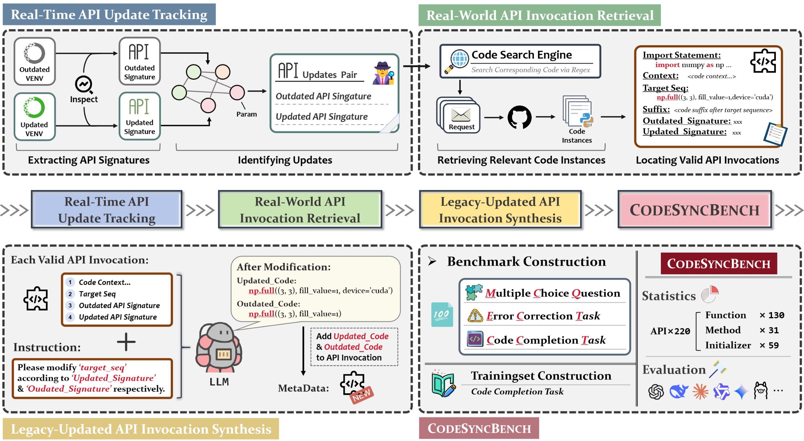
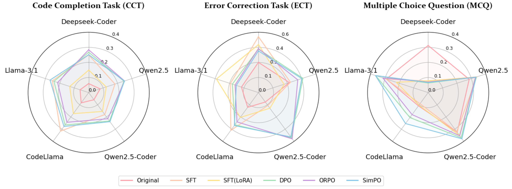

<div align="center">
<h1>CODESYNC: Synchronizing Large Language Models with Dynamic Code Evolution at Scale </h1>

[](https://arxiv.org/abs/2502.16645)
[]()



<p align="center">

</p>
</div>

## 💡 Updates & News
- [01/05/2025] : Our paper has been accepted by [ICML 2025](https://icml.cc/)!
- [25/02/2025] :page_facing_up: Our paper has been released on [Arxiv](https://arxiv.org/abs/2502.16645) today!


## :memo: Contents

- [💡 Updates \& News](#-updates--news)
- [:memo: Contents](#memo-contents)
- [💾 CODESYNC](#-codesync)
- [🚀 Execution](#-execution)
- [🤗 Contributing](#-contributing)
- [👍 Acknowledgement](#-acknowledgement)
- [⭐ Citation](#-citation)


<!-- ## Installation -->

## 💾 CODESYNC

⚠️ **Work in progress** 
P.S. We will finish the program until June.

See the [repository](https://github.com/Lucky-Wang-Chenlong/CodeSync).

`CodeSync` is a data engine used for generating training set and benchmark automatically to assess the capabilities of LLMs on synchronizing with specific-version APIs. 

`CodeSync` consists of 4 key steps, as illustrated above:
- **Real-Time API Update Tracking**: tracks and collects API updates by comparing legacy and specific versions of libraries. 
- **Real-World API Invocation Retrieval**: crawl API invocations an locate valid API calls.
- **Legacy-Updated API Invocation Synthesis**: leverages LLMs to synthesize new API invocation statements based on legacy and updated signatures, respectively, and reorganize to **Metadata**.
- **CodeSyncBench Constructor**: generate a comprehensive benchmark based on **Metadata**.

For more details, please refer to [paper](https://arxiv.org/abs/2502.16645).

The implementation of `CodeSync` can be referenced in [DataProcessor](DataProcessor/README.md). 

## 🚀 Execution
You can execute `CodeSync` by executing [bash script](DataProcessor/codesync.sh):
```bash
codesync.sh --crawling --filter --synthesis --benchmark
```
or executing [python script](DataProcessor/pipeline.py):
```bash
pipeline.py --crawling True --filter True --synthesis True --benchmark True
```

## 🤗 Contributing
Contributions to this project are welcome. Please consider the following ways to contribute:

- Reporting issues
- Proposing new features or improvements
- Benchmark other mainstream LLMs


## 👍 Acknowledgement
Many thanks to Zhaoyang Chu and Zhengxiang Cheng for their invaluable effort in this project!

We also thank these great projects:
- [HumanEval](https://github.com/openai/human-eval) is a widely used Python dataset to evaluate code generation. 
- [LLaMA-Factory](https://github.com/hiyouga/LLaMA-Factory) is a reliable framework for tuning models
- [BigCode-Evaluation](https://github.com/bigcode-project/bigcode-evaluation-harness) is an excellent framework for evaluation of code generation models.

## ⭐ Citation

```
@misc{wang2025codesync,
      title={CODESYNC: Synchronizing Large Language Models with Dynamic Code Evolution at Scale}, 
      author={Chenlong Wang and Zhaoyang Chu and Zhengxiang Cheng and Xuyi Yang and Kaiyue Qiu and Yao Wan and Zhou Zhao and Xuanhua Shi and Dongping Chen},
      year={2025},
      eprint={2502.16645},
      archivePrefix={arXiv},
      primaryClass={cs.CL},
      url={https://arxiv.org/abs/2502.16645}, 
}
```
