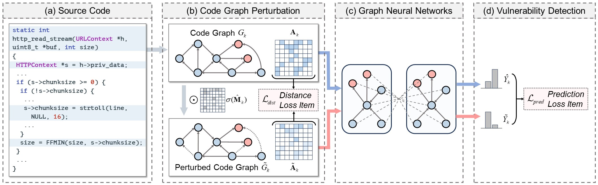

# counterfactual-vulnerability-detection

Welcome to our repository 🌟. 
Here, we provide a PyTorch implementation for our paper 📚 "Graph Neural Networks for Vulnerability Detection - A Counterfactual Explanation", which has been accepted by ISSTA'24. 
We're delighted to share our work with the community and encourage collaborative exploration and discussion. 
If you have any questions or encounter issues with our code, please feel free to submit them through the `Issues` section.
Our implementation has also been archived in the open-source project [NaturalCC](https://github.com/CGCL-codes/naturalcc), linked at [https://github.com/CGCL-codes/naturalcc/tree/main/examples/counterfactual-vulnerability-detection](https://github.com/CGCL-codes/naturalcc/tree/main/examples/counterfactual-vulnerability-detection).



**Repository Overview:**
- [Environment Configuration](#environment-configuration) - Guides on setting up the necessary environment to run our code.
- [Data Preparation](#data-preparation) - Instructions on how to prepare your data for use with our models.
- [Training GNN-based Vulnerability Detector](#training-gnn-based-vulnerability-detector) - Steps to train the Graph Neural Network model for vulnerability detection.
- [Explaining GNN-based Vulnerability Detector](#explaining-gnn-based-vulnerability-detector) - Steps to generate explanations on how the GNN model makes its decisions.

# Environment Configuration

## CUDA Dependencies

Our work hinges on specific versions of the CUDA Toolkit and cuDNN. Ensure you have the following versions installed:
- **CUDA Toolkit**: Version 11.7.0
- **cuDNN**: Version 8.8.1 (compatible with CUDA 11.x)

To set things up:
1. Download the required versions:
    - [CUDA Toolkit Archive](https://developer.nvidia.com/cuda-toolkit-archive)
    - [cuDNN Archive](https://developer.nvidia.com/rdp/cudnn-archive)
2. Installing CUDA:
    ```shell
    sudo sh cuda_11.7.0_515.43.04_linux.run
    ```
3. Setting up cuDNN:
    ```shell
    tar -zxvf cudnn-linux-x86_64-8.8.1.3_cuda11-archive.tar.xz
    sudo cp cudnn-linux-x86_64-8.8.1.3_cuda11-archive/include/cudnn.h  /usr/local/cuda-11.7/include
    sudo cp cudnn-linux-x86_64-8.8.1.3_cuda11-archive/lib/libcudnn*  /usr/local/cuda-11.7/lib64
    sudo chmod a+r /usr/local/cuda-11.7/include/cudnn.h  /usr/local/cuda-11.7/lib64/libcudnn*
    ```
4. Configuring environment variables:
    ```shell
    export LD_LIBRARY_PATH=$LD_LIBRARY_PATH:/usr/local/cuda-11.7/lib64
    export PATH=$PATH:/usr/local/cuda-11.7/bin
    export CUDA_HOME=$CUDA_HOME:/usr/local/cuda-11.7
    ```

## Python Library Dependencies

Start by creating a Conda environment:
```shell
conda create -n cfvd python=3.9
conda activate cfvd
```

Our implementation is built upon specific versions of PyTorch and Pytorch Geometric:
- **PyTorch**: Version 2.0.0
- **Pytorch Geometric**: Version 2.3.1

Install them using the following commands:
```shell
pip install https://download.pytorch.org/whl/cu117/torch-2.0.0%2Bcu117-cp39-cp39-linux_x86_64.whl
pip install https://download.pytorch.org/whl/cu117/torchvision-0.15.1%2Bcu117-cp39-cp39-linux_x86_64.whl
pip install https://data.pyg.org/whl/torch-2.0.0%2Bcu117/pyg_lib-0.2.0%2Bpt20cu117-cp39-cp39-linux_x86_64.whl
pip install https://data.pyg.org/whl/torch-2.0.0%2Bcu117/torch_cluster-1.6.1%2Bpt20cu117-cp39-cp39-linux_x86_64.whl
pip install https://data.pyg.org/whl/torch-2.0.0%2Bcu117/torch_scatter-2.1.1%2Bpt20cu117-cp39-cp39-linux_x86_64.whl
pip install https://data.pyg.org/whl/torch-2.0.0%2Bcu117/torch_sparse-0.6.17%2Bpt20cu117-cp39-cp39-linux_x86_64.whl
pip install https://data.pyg.org/whl/torch-2.0.0%2Bcu117/torch_spline_conv-1.2.2%2Bpt20cu117-cp39-cp39-linux_x86_64.whl
pip install torch_geometric
```

Other required Python packages are as follows:
```shell
pip install numpy==1.24.3
pip install pandas==2.0.1
pip install scikit-learn==1.2.2
pip install tensorboard==2.13.0
pip install transformers==4.29.1
pip install tqdm==4.65.0
pip install scipy==1.10.1
pip install graphviz==0.20.1
pip install unidiff==0.7.5
pip install dive-into-graphs==1.1.0
pip install captum==0.2.0
pip install matplotlib==3.7.1
pip install rdkit
```

## Joern

For this project, we leverage Joern to generate graphs for both vulnerable and non-vulnerable code segments. It's crucial to note that Joern is an actively developed tool, undergoing frequent updates that might introduce changes in functionality. If you aim to replicate our graph generation process seamlessly, we recommend using Joern version 1.1.260. Here's how you can set it up:
```shell
wget https://github.com/joernio/joern/releases/download/v1.1.260/joern-install.sh
chmod +x ./joern-install.sh
printf 'Y\n/bin/joern\ny\n/usr/local/bin\n\n'  | sudo ./joern-install.sh --interactive
```

For those venturing with newer Joern versions or if you have specific inquiries regarding Joern's capabilities, we suggest visiting Joern's official repository: [Joern GitHub Repository](https://github.com/joernio/joern). It offers comprehensive documentation and insights on code graph generation and more.

# Data Preparation

Our data preparation process is closely aligned with the [LineVd](https://github.com/davidhin/linevd) project. Here's a step-by-step guide on how to set up and process the dataset.

## Download

To begin with, download the cleaned version of the Big-Vul dataset by fetching the `MSR_data_cleaned.csv` file from this [link](https://drive.google.com/file/d/1-0VhnHBp9IGh90s2wCNjeCMuy70HPl8X/view). For detailed information of Big-Vul, please visit its [official repository](https://github.com/ZeoVan/MSR_20_Code_vulnerability_CSV_Dataset).

Once downloaded, decompress and move the dataset to the appropriate location with the commands below:
```shell
unzip MSR_data_cleaned.zip
rm MSR_data_cleaned.zip
mv MSR_data_cleaned.csv cfexplainer/storage/external
```

Run the following commands to configure the data storage path:
```shell
cd cfexplainer
export SINGSTORAGE=$(pwd)
```

## Data Preprocessing

To preprocess the Big-Vul dataset, run:

```shell
python data_pre.py
```

Upon successful execution, a `storage/cache` directory will be created. This serves as the location to store cached data from script runs. Within this directory, you'll find two sub-directories: `minimal_datasets` and `bigvul`. These are designed for quick access to the preprocessed Big-Vul dataset.


## Code Graph Generation

To generate code graphs using the Joern tool, follow these sequential commands:
```shell
python code_graph_gen.py 1
python code_graph_gen.py 2
python code_graph_gen.py 3
python code_graph_gen.py 4
python code_graph_gen.py 5
```

These commands will create a directory `storage/processed/bigvul`, which contains two directories `before` and `after`. The `before` directory houses code graphs of the vulnerable code snippets, whereas the `after` directory holds the graphs of their corresponding repaired versions. For example, the files `before/177736.c`, `before/177736.nodes.json`, and `before/177736.edges.json` store the original source code, node properties, and control/data flow edges for the sample with the ID `177736` in the Big-Vul dataset.

Then, you can construct the code graph datasets for `train/valid/test` partitions, executing these commands:
```shell
python graph_dataset.py train
python graph_dataset.py val
python graph_dataset.py test
```
It will result in a directory `storage/cache/vul_graph_feat` caching graph features of codes. Concurrently, three new directories `storage/processed/vul_graph_dataset/train_processed`, `storage/processed/vul_graph_dataset/val_processed`, and `storage/processed/vul_graph_dataset/test_processed` will be formed, housing the partitioned code graph datasets. In these graph datasets, each of individual code graph has a node feature matrix $\mathbf{X} \in \mathcal{R}^{n \times d}$ and an adjacent matrix $\mathbf{A} \in \mathcal{R}^{n \times n}$, where $n$ represents the number of nodes and $d$ is the feature dimension. To save memory space, the adjacency matrix adopts the `edge index` data structure. The `edge index` is a $2 \times E$ matrix, where $E$ is the number of edges. The two rows represent:
- The first row contains the source nodes of the edges.
- The second row contains the target nodes of the edges.

For example, if the `edge index` contains a column $[3, 5]$, this represents an edge from node 3 to node 5.

## Extracting Differences in Code Versions

To extract lines that were removed from the before version and those that were added to the after version, specifically for vulnerable codes, execute the following command:
```shell
python line_extract.py
```
This command will generate a file at `storage/processed/bigvul/eval/statement_labels.pkl` containing the extracted "removed/added" lines.


# Training GNN-based Vulnerability Detector

This work investigates four vulnerability detectors based on different GNN architectures: Graph Convolutional Network (GCN), Gated Graph Neural Network (GGNN), Graph Isomorphism Network (GIN), and GraphConv. 

To train these detectors, execute the following commands:
```shell
python main.py --do_train --do_test --gnn_model GCNConv --cuda_id 0
python main.py --do_train --do_test --gnn_model GatedGraphConv --num_gnn_layers 1 --num_ggnn_steps 2 --ggnn_aggr mean --cuda_id 0
python main.py --do_train --do_test --gnn_model GINConv --gin_eps 0.2 --cuda_id 0
python main.py --do_train --do_test --gnn_model GraphConv --gconv_aggr add --cuda_id 0
```

Once executed successfully, the trained model checkpoints will be saved to the directory: `storage/cache/saved_models`. These checkpoints represent the GNN-based detectors that have achieved the best performance on the validation set.

# Explaining GNN-based Vulnerability Detector

Once the GNN-based vulnerability detectors are trained, you can explain the prediction results of GNN-based detectors using different explainers. Our research introduces a novel counterfactual-based explainer: `cfexplainer`. Additionally, for comparison purposes, we also include six factual-based explainers that serve as baselines: `gnnexplainer`, `pgexplainer`, `subgraphx`, `gnn_lrp`, `deeplift`, `gradcam`.

Run the following commands to train these explainers on different GNN-based detectors:
```shell
python main.py --do_test --do_explain --gnn_model GCNConv --ipt_method specific_explainer --KM 8 --cuda_id 0
python main.py --do_test --do_explain --gnn_model GatedGraphConv --num_gnn_layers 1 --num_ggnn_steps 2 --ggnn_aggr mean --ipt_method specific_explainer --KM 8 --cuda_id 0
python main.py --do_test --do_explain --gnn_model GINConv --gin_eps 0.2 --ipt_method specific_explainer --KM 8 --cuda_id 0
python main.py --do_test --do_explain --gnn_model GraphConv --gconv_aggr add --ipt_method specific_explainer --KM 8 --cuda_id 0
```

See the `scripts.sh` file for more information on the commands used to conduct our experiments.

**🚨 Reproducibility Note**

We run all experiments on a standard server equipped with two Intel Xeon Gold 5117 CPUs and 4 Tesla V100 GPUs. To ensure the reproducibility of our work, we have taken many measures, including fixing random seeds, adopting deterministic configurations in PyTorch, and sharing key intermediate files on [Google Drive](https://drive.google.com/drive/folders/12iUTp4YFRG9qgAtqOV0hXRDpMZmvDp_O?usp=sharing). 

Despite these efforts, we acknowledge that completely reproducible results might not be guaranteed. This limitation is due to potential variations across different PyTorch releases, platforms, and computing machines. 

If you encounter any significant discrepancies in your replication attempts, please let us know by raising an issue. Your feedback is invaluable for improving this work and assisting the wider research community.
