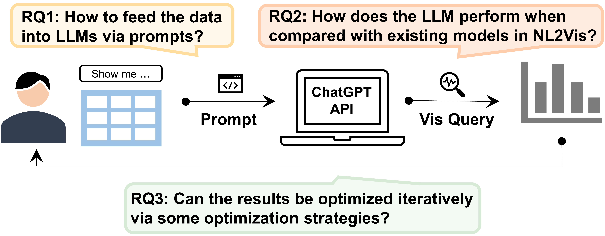

# Automated Data Visualization from Natural Language via Large LanguageModels: An Exploratory Study

This project aims to investigate the use of large language models (LLMs) for natural language to visualization (NL2Vis) tasks. By employing various table representation formats and optimization strategies, alongside state-of-the-art model techniques, we enhance the models' ability to understand and represent data.
<p align="center">
    <br>

    <br>
<p>

## Table Representation Formats

We incorporate multiple methods for representing tabular data, located in distinct folders, as follows:
<p align="center">
    <br>

    <br>
<p>

- **A. Table Serialization**: "Table(Column)" and "Column=[]" methods for direct schema representation.
  ```bash
  python table_serialization/table(column).py
  python table_serialization/column=[].py
  ```
- **B. Table Summarization**: Natural language summaries of tables using ChatGPT.
  ```bash
  python table_summarization/chat2vis.py
  python table_summarization/table2nl.py
  ```
- **C. Table Markup Formatting**: Utilizes CSV, JSON, Markdown, and XML for data representation.
  ```bash
  python table_table_markup_format/table_format_csv.py
  python table_table_markup_format/table_format_json.py
  python table_table_markup_format/table_format_markdown.py
  python table_table_markup_format/table_format_xml.py
  ```
- **D. Table Programming**: Adapts tables into SQL and Python code for LLM processing.
  ```bash
  python table_programming/table2code.py
  python table_programming/table2sql.py
  ```
## Optimization Strategies

Several optimization strategies are implemented to enhance model performance, including:
<p align="center">
    <br>

    <br>
<p>

- **GPT-3.5 Turbo COTSketch**: Leveraging Chain of Thought (COT) techniques for optimized VQL generation.
  ```bash
  python optimization_strategy/table2sql_gpt3.5turbo_cotsketch.py
  ```
- **GPT-3.5 Turbo RolePlay**: Optimizing interactive data exploration through role-playing techniques.
  ```bash
  python optimization_strategy/table2sql_gpt3.5turbo_roleplay.py
  ```
- **GPT-4 SelfRepair**: Utilizing the self-repair capability of GPT-4 to optimize erroneous queries and data representations.
  ```bash
  python optimization_strategy/table2sql_gpt4_selfrepair.py
  ```
## Configurable Parameters

The project's codebase is designed with flexibility in mind, allowing users to adjust various parameters based on their requirements. Below are the key configurable parameters:

- **Data Type**: Determines the subset of data used for training or evaluation. Users can select between `radn_split` for randomly split data and `final_processed` for fully processed data. This choice affects the input data's format and preprocessing steps.

    ```python
    data_type = 'radn_split'  # Options: 'radn_split', 'final_processed'
    ```

- **Model Type**: Specifies the Large Language Model (LLM) used for the task. The code supports a range of models from GPT-2 to GPT-4, including specialized versions like "text-davinci-003" from OpenAI. This allows for experimentation across different model capabilities and sizes.

    ```python
    model_type = 'gpt3'  # Options: 'gpt2', 'gpt3', 'gpt3.5', 'gpt4'
    model = "text-davinci-003"  # Alternatives: "gpt-4", etc.
    ```

- **Limit Table Rows**: Sets the maximum number of rows to include from each table during processing. This parameter is essential for managing computational load and focusing the model's attention on the most relevant data.

    ```python
    limit_table = 3  # Adjust as necessary to fit the use case.
    ```

These parameters are just examples of the customization options available. Users are encouraged to adjust these settings to optimize performance for their specific data and modeling objectives.

## Data Preparation

Download the nvBench database for model training and evaluation. Interested parties can download the database files from the official repository:
[nvBench GitHub Repository](https://github.com/TsinghuaDatabaseGroup/nvBench).
Ensure the database files are placed in the `data/database` directory. Follow the preparation process, which includes downloading, preprocessing, and splitting the data to suit various training and testing scenarios.

## Baselines

[//]: # (These baselines include open-source models and adaptations from well-regarded sources in the field.)
[//]: # (- An open-source model [ncNet]&#40;https://github.com/Thanksyy/ncNet&#41;.)

[//]: # ()
[//]: # (- Spider Baseline Models.)

[//]: # (We adapted the `seq2vis` model from the Spider project's baseline models, which you can find via [Spider seq2seq_attention_copy]&#40;https://github.com/taoyds/spider/tree/master/baselines/seq2seq_attention_copy&#41;)

[//]: # (Specifically, we have replicated the transformer model for NL2Vis tasks.)

[//]: # (- T5 Models. )

[//]: # ()
[//]: # (Leveraging the versatility of the T5 models for NL2Vis tasks, we utilize both the [Hugging Face - T5 Base]&#40;https://huggingface.co/google-t5/t5-base&#41; and [Hugging Face - T5 Small]&#40;https://huggingface.co/google-t5/t5-small&#41; for our experiments.)

[//]: # ()
[//]: # (For targeted parsing and decoding tasks, we also incorporate )

[//]: # ()
[//]: # ([Picard]&#40;https://github.com/ServiceNow/picard&#41;.)
We use open-source models and established baselines for comparison:

- ncNet: An open-source model available at [ncNet](https://github.com/Thanksyy/ncNet).
- Spider Baseline Models: The seq2vis model from the Spider project is adapted for NL2Vis, detailed at [Spider seq2seq_attention_copy](https://github.com/taoyds/spider/tree/master/baselines/seq2seq_attention_copy).
- T5 Models: For versatility, we employ [Hugging Face - T5 Base](https://huggingface.co/google-t5/t5-base) and [Hugging Face - T5 Small](https://huggingface.co/google-t5/t5-small), along with the [Picard](https://github.com/ServiceNow/picard) parser.
## Evaluation Process

Customize the evaluation script to assess model predictions:


```bash
python evaluate.py --gold PATH_TO_GOLD --pred PATH_TO_PREDICTIONS --db DATABASE_DIR --table TABLES_JSON --etype EVALUATION_TYPE
```
