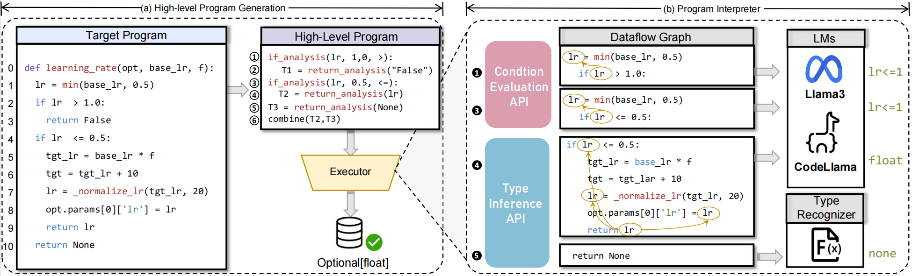

# Nester

This is the guide released for the paper "Neuro-Symbolic Language Models for Type Inference."

## Requirements

- Python >= 3.9
- Linux

## Install

Clone this repository and run the following command in the root directory to install the required dependencies:

```
pip install -r requirements.txt
```

## Usage

1. To extract the file, use the following command:
```
unzip data/data.zip -d path/to/data
```

2. Set up language models such as Llama and CodeLlama locally:
   - Llama: https://ai.meta.com/llama/
   - CodeLlama: https://ai.meta.com/blog/large-language-model-llama-codellama/
3. Generate high-level programs using these LLMs.
```
python high_level.py
```

4. Run the interpreters to execute the programs.
```
python program_interpreter.py
```

### Evaluate

To evaluate the Nester results, use the following command to calculate the Exact Match metric:

```
python nester/evaluate.py -s predictions.json -t testset.json -m -c
```

For match to parametric evaluation, simply add the `-i` option:

```
python nester/evaluate.py -s predictions.json -t testset.json -m -c -i
```


### Environment Requirements

- PyTorch

### Example Illustration

Below is an example illustration from Nester:



### Results

We include the predictions of Nester in our dataset and its ablation results in the ```predictions/``` folder.

